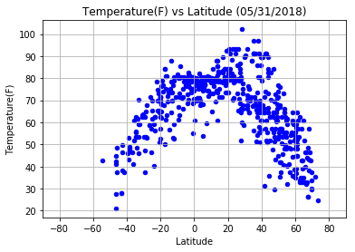
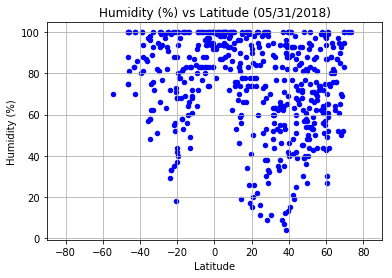
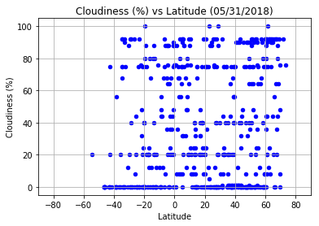
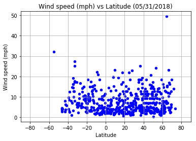

```python
#Import Dependencies
from config import api_key
from citipy import citipy
import random
import requests
import pandas as pd
import numpy as np
import matplotlib.pyplot as plt
import matplotlib
import time
```


```python
#Observations:
    
#1. Latitudes from 0 to 20 seem to have the highest temperatures
#2. Most cities seem to have a humidity of 50% or higher
#3. Wind speeds rarely gets above 30mph in almost all the cities
```


```python
# Getting a sample that is representative of the world cities.

# Set Lat & Lon Zones to randomly pick coordinates
lat_zone = np.arange(-90,90,15)
lon_zone = np.arange(-180,180,15)

cities_df = pd.DataFrame()

cities_df["Latitude"] = ""
cities_df["Longitude"] = ""

# Randomly pick coordinates and adding to the dataframe.
for x in lat_zone:
    for y in lon_zone:
        x_values = list(np.arange(x,x+15,0.1))
        y_values = list(np.arange(y,y+15,0.1))
        lats = random.sample(x_values,15)
        lons = random.sample(y_values,15)
        cities_df = cities_df.append(pd.DataFrame({"Latitude":lats,
                                       "Longitude":lons}))
cities_df = cities_df.reset_index(drop=True)
```


```python
# For the coordinates, use citipy to associate them with nearest city.

for index,row in cities_df.iterrows():
    city = citipy.nearest_city(row["Latitude"],row["Longitude"])
    cities_df.set_value(index,"Closest City name",city.city_name)
    cities_df.set_value(index,"Closest Country code",city.country_code)

# Dropping random lat and lon samples from dataframe as they are not the exact coordinates for the cities.
final_cities_df = cities_df.drop(['Latitude', 'Longitude'],axis=1)

# Dropping duplicate cities which may have resulted in the previous step
final_cities_df = final_cities_df.drop_duplicates()
final_cities_df = final_cities_df.reset_index(drop=True)

```

    C:\Users\Hannah\Anaconda3\envs\PythonData\lib\site-packages\ipykernel\__main__.py:5: FutureWarning: set_value is deprecated and will be removed in a future release. Please use .at[] or .iat[] accessors instead
    C:\Users\Hannah\Anaconda3\envs\PythonData\lib\site-packages\ipykernel\__main__.py:6: FutureWarning: set_value is deprecated and will be removed in a future release. Please use .at[] or .iat[] accessors instead
    


```python
# Picking a sample of 500 cities to proceed with analysis
sample_cities = final_cities_df.sample(600)
sample_cities = sample_cities.reset_index(drop=True)
```


```python
# Save config information.
url = "http://api.openweathermap.org/data/2.5/weather?"
units = "imperial"

# Build partial query URL
query_url = f"{url}appid={api_key}&units={units}&q="
params = { "appid":api_key,"units":"imperial" }
```


```python
def encrypt_key(input_url):
    return input_url[0:53]+"<YourKey>"+input_url[85:]

for index,row in sample_cities.iterrows():
    params["q"] =f'{row["Closest City name"]},{row["Closest Country code"]}'
    print(f"Retrieving weather information for {params['q']}")
    weather_resp = requests.get(url,params)
    print(encrypt_key(weather_resp.url))
    weather_resp  = weather_resp.json()
    sample_cities.set_value(index,"Latitude",weather_resp.get("coord",{}).get("lat"))
    sample_cities.set_value(index,"Longitude",weather_resp.get("coord",{}).get("lon"))
    sample_cities.set_value(index,"Temperature",weather_resp.get("main",{}).get("temp_max"))
    sample_cities.set_value(index,"Wind speed",weather_resp.get("wind",{}).get("speed"))
    sample_cities.set_value(index,"Humidity",weather_resp.get("main",{}).get("humidity"))
    sample_cities.set_value(index,"Cloudiness",weather_resp.get("clouds",{}).get("all"))
    try:
        date = sample_cities["dt"]
        sample_cities.append(date)
    except(KeyError):
        continue
```

    Retrieving weather information for tecoanapa,mx
    http://api.openweathermap.org/data/2.5/weather?appid=<YourKey>&units=imperial&q=tecoanapa%2Cmx
    Retrieving weather information for havre-saint-pierre,ca
    

    C:\Users\Hannah\Anaconda3\envs\PythonData\lib\site-packages\ipykernel\__main__.py:10: FutureWarning: set_value is deprecated and will be removed in a future release. Please use .at[] or .iat[] accessors instead
    C:\Users\Hannah\Anaconda3\envs\PythonData\lib\site-packages\ipykernel\__main__.py:11: FutureWarning: set_value is deprecated and will be removed in a future release. Please use .at[] or .iat[] accessors instead
    C:\Users\Hannah\Anaconda3\envs\PythonData\lib\site-packages\ipykernel\__main__.py:12: FutureWarning: set_value is deprecated and will be removed in a future release. Please use .at[] or .iat[] accessors instead
    C:\Users\Hannah\Anaconda3\envs\PythonData\lib\site-packages\ipykernel\__main__.py:13: FutureWarning: set_value is deprecated and will be removed in a future release. Please use .at[] or .iat[] accessors instead
    C:\Users\Hannah\Anaconda3\envs\PythonData\lib\site-packages\ipykernel\__main__.py:14: FutureWarning: set_value is deprecated and will be removed in a future release. Please use .at[] or .iat[] accessors instead
    C:\Users\Hannah\Anaconda3\envs\PythonData\lib\site-packages\ipykernel\__main__.py:15: FutureWarning: set_value is deprecated and will be removed in a future release. Please use .at[] or .iat[] accessors instead
    

    http://api.openweathermap.org/data/2.5/weather?appid=<YourKey>&units=imperial&q=havre-saint-pierre%2Cca
    Retrieving weather information for okhotsk,ru
    http://api.openweathermap.org/data/2.5/weather?appid=<YourKey>&units=imperial&q=okhotsk%2Cru
    Retrieving weather information for abu kamal,sy
    http://api.openweathermap.org/data/2.5/weather?appid=<YourKey>&units=imperial&q=abu+kamal%2Csy
    Retrieving weather information for atar,mr
    http://api.openweathermap.org/data/2.5/weather?appid=<YourKey>&units=imperial&q=atar%2Cmr
    Retrieving weather information for santa maria,cv
    http://api.openweathermap.org/data/2.5/weather?appid=<YourKey>&units=imperial&q=santa+maria%2Ccv
    Retrieving weather information for minab,ir
    http://api.openweathermap.org/data/2.5/weather?appid=<YourKey>&units=imperial&q=minab%2Cir
    Retrieving weather information for kamina,cd
    http://api.openweathermap.org/data/2.5/weather?appid=<YourKey>&units=imperial&q=kamina%2Ccd
    Retrieving weather information for alofi,nu
    http://api.openweathermap.org/data/2.5/weather?appid=<YourKey>&units=imperial&q=alofi%2Cnu
    Retrieving weather information for qaqortoq,gl
    http://api.openweathermap.org/data/2.5/weather?appid=<YourKey>&units=imperial&q=qaqortoq%2Cgl
    Retrieving weather information for lephepe,bw
    http://api.openweathermap.org/data/2.5/weather?appid=<YourKey>&units=imperial&q=lephepe%2Cbw
    Retrieving weather information for ngunguru,nz
    http://api.openweathermap.org/data/2.5/weather?appid=<YourKey>&units=imperial&q=ngunguru%2Cnz
    Retrieving weather information for makurdi,ng
    http://api.openweathermap.org/data/2.5/weather?appid=<YourKey>&units=imperial&q=makurdi%2Cng
    Retrieving weather information for dalaba,gn
    http://api.openweathermap.org/data/2.5/weather?appid=<YourKey>&units=imperial&q=dalaba%2Cgn
    Retrieving weather information for erenhot,cn
    http://api.openweathermap.org/data/2.5/weather?appid=<YourKey>&units=imperial&q=erenhot%2Ccn
    Retrieving weather information for maragheh,ir
    http://api.openweathermap.org/data/2.5/weather?appid=<YourKey>&units=imperial&q=maragheh%2Cir
    Retrieving weather information for gornopravdinsk,ru
    http://api.openweathermap.org/data/2.5/weather?appid=<YourKey>&units=imperial&q=gornopravdinsk%2Cru
    Retrieving weather information for bilibino,ru
    http://api.openweathermap.org/data/2.5/weather?appid=<YourKey>&units=imperial&q=bilibino%2Cru
    Retrieving weather information for haines junction,ca
    http://api.openweathermap.org/data/2.5/weather?appid=<YourKey>&units=imperial&q=haines+junction%2Cca
    Retrieving weather information for kuhestan,af
    http://api.openweathermap.org/data/2.5/weather?appid=<YourKey>&units=imperial&q=kuhestan%2Caf
    Retrieving weather information for port hardy,ca
    http://api.openweathermap.org/data/2.5/weather?appid=<YourKey>&units=imperial&q=port+hardy%2Cca
    Retrieving weather information for ilulissat,gl
    http://api.openweathermap.org/data/2.5/weather?appid=<YourKey>&units=imperial&q=ilulissat%2Cgl
    Retrieving weather information for bakchar,ru
    http://api.openweathermap.org/data/2.5/weather?appid=<YourKey>&units=imperial&q=bakchar%2Cru
    Retrieving weather information for jacareacanga,br
    http://api.openweathermap.org/data/2.5/weather?appid=<YourKey>&units=imperial&q=jacareacanga%2Cbr
    Retrieving weather information for samarinda,id
    http://api.openweathermap.org/data/2.5/weather?appid=<YourKey>&units=imperial&q=samarinda%2Cid
    Retrieving weather information for ponta do sol,pt
    http://api.openweathermap.org/data/2.5/weather?appid=<YourKey>&units=imperial&q=ponta+do+sol%2Cpt
    Retrieving weather information for kutulik,ru
    http://api.openweathermap.org/data/2.5/weather?appid=<YourKey>&units=imperial&q=kutulik%2Cru
    Retrieving weather information for pisco,pe
    http://api.openweathermap.org/data/2.5/weather?appid=<YourKey>&units=imperial&q=pisco%2Cpe
    Retrieving weather information for pringsewu,id
    http://api.openweathermap.org/data/2.5/weather?appid=<YourKey>&units=imperial&q=pringsewu%2Cid
    Retrieving weather information for khash,ir
    http://api.openweathermap.org/data/2.5/weather?appid=<YourKey>&units=imperial&q=khash%2Cir
    Retrieving weather information for akyab,mm
    http://api.openweathermap.org/data/2.5/weather?appid=<YourKey>&units=imperial&q=akyab%2Cmm
    Retrieving weather information for tabiauea,ki
    http://api.openweathermap.org/data/2.5/weather?appid=<YourKey>&units=imperial&q=tabiauea%2Cki
    Retrieving weather information for bluff,nz
    http://api.openweathermap.org/data/2.5/weather?appid=<YourKey>&units=imperial&q=bluff%2Cnz
    Retrieving weather information for aykhal,ru
    http://api.openweathermap.org/data/2.5/weather?appid=<YourKey>&units=imperial&q=aykhal%2Cru
    Retrieving weather information for geraldton,au
    http://api.openweathermap.org/data/2.5/weather?appid=<YourKey>&units=imperial&q=geraldton%2Cau
    Retrieving weather information for xinqing,cn
    http://api.openweathermap.org/data/2.5/weather?appid=<YourKey>&units=imperial&q=xinqing%2Ccn
    Retrieving weather information for banff,ca
    http://api.openweathermap.org/data/2.5/weather?appid=<YourKey>&units=imperial&q=banff%2Cca
    Retrieving weather information for saint george,bm
    http://api.openweathermap.org/data/2.5/weather?appid=<YourKey>&units=imperial&q=saint+george%2Cbm
    Retrieving weather information for kourou,gf
    http://api.openweathermap.org/data/2.5/weather?appid=<YourKey>&units=imperial&q=kourou%2Cgf
    Retrieving weather information for kaitangata,nz
    http://api.openweathermap.org/data/2.5/weather?appid=<YourKey>&units=imperial&q=kaitangata%2Cnz
    Retrieving weather information for solano,co
    http://api.openweathermap.org/data/2.5/weather?appid=<YourKey>&units=imperial&q=solano%2Cco
    Retrieving weather information for gigmoto,ph
    http://api.openweathermap.org/data/2.5/weather?appid=<YourKey>&units=imperial&q=gigmoto%2Cph
    Retrieving weather information for weligama,lk
    http://api.openweathermap.org/data/2.5/weather?appid=<YourKey>&units=imperial&q=weligama%2Clk
    Retrieving weather information for khatanga,ru
    http://api.openweathermap.org/data/2.5/weather?appid=<YourKey>&units=imperial&q=khatanga%2Cru
    Retrieving weather information for kandalaksha,ru
    http://api.openweathermap.org/data/2.5/weather?appid=<YourKey>&units=imperial&q=kandalaksha%2Cru
    Retrieving weather information for evans,us
    http://api.openweathermap.org/data/2.5/weather?appid=<YourKey>&units=imperial&q=evans%2Cus
    Retrieving weather information for riverton,nz
    http://api.openweathermap.org/data/2.5/weather?appid=<YourKey>&units=imperial&q=riverton%2Cnz
    Retrieving weather information for thanh hoa,vn
    http://api.openweathermap.org/data/2.5/weather?appid=<YourKey>&units=imperial&q=thanh+hoa%2Cvn
    Retrieving weather information for kapoeta,sd
    http://api.openweathermap.org/data/2.5/weather?appid=<YourKey>&units=imperial&q=kapoeta%2Csd
    Retrieving weather information for bud,no
    http://api.openweathermap.org/data/2.5/weather?appid=<YourKey>&units=imperial&q=bud%2Cno
    Retrieving weather information for omboue,ga
    http://api.openweathermap.org/data/2.5/weather?appid=<YourKey>&units=imperial&q=omboue%2Cga
    Retrieving weather information for le mars,us
    http://api.openweathermap.org/data/2.5/weather?appid=<YourKey>&units=imperial&q=le+mars%2Cus
    Retrieving weather information for sirjan,ir
    http://api.openweathermap.org/data/2.5/weather?appid=<YourKey>&units=imperial&q=sirjan%2Cir
    Retrieving weather information for meru,ke
    http://api.openweathermap.org/data/2.5/weather?appid=<YourKey>&units=imperial&q=meru%2Cke
    Retrieving weather information for eyl,so
    http://api.openweathermap.org/data/2.5/weather?appid=<YourKey>&units=imperial&q=eyl%2Cso
    Retrieving weather information for dibaya,cd
    http://api.openweathermap.org/data/2.5/weather?appid=<YourKey>&units=imperial&q=dibaya%2Ccd
    Retrieving weather information for bandarbeyla,so
    http://api.openweathermap.org/data/2.5/weather?appid=<YourKey>&units=imperial&q=bandarbeyla%2Cso
    Retrieving weather information for mar del plata,ar
    http://api.openweathermap.org/data/2.5/weather?appid=<YourKey>&units=imperial&q=mar+del+plata%2Car
    Retrieving weather information for hemsedal,no
    http://api.openweathermap.org/data/2.5/weather?appid=<YourKey>&units=imperial&q=hemsedal%2Cno
    Retrieving weather information for abalak,ne
    http://api.openweathermap.org/data/2.5/weather?appid=<YourKey>&units=imperial&q=abalak%2Cne
    Retrieving weather information for belyy yar,ru
    http://api.openweathermap.org/data/2.5/weather?appid=<YourKey>&units=imperial&q=belyy+yar%2Cru
    Retrieving weather information for massakory,td
    http://api.openweathermap.org/data/2.5/weather?appid=<YourKey>&units=imperial&q=massakory%2Ctd
    Retrieving weather information for barbar,sd
    http://api.openweathermap.org/data/2.5/weather?appid=<YourKey>&units=imperial&q=barbar%2Csd
    Retrieving weather information for asau,tv
    http://api.openweathermap.org/data/2.5/weather?appid=<YourKey>&units=imperial&q=asau%2Ctv
    Retrieving weather information for tiruvottiyur,in
    http://api.openweathermap.org/data/2.5/weather?appid=<YourKey>&units=imperial&q=tiruvottiyur%2Cin
    Retrieving weather information for kangaba,ml
    http://api.openweathermap.org/data/2.5/weather?appid=<YourKey>&units=imperial&q=kangaba%2Cml
    Retrieving weather information for grindavik,is
    http://api.openweathermap.org/data/2.5/weather?appid=<YourKey>&units=imperial&q=grindavik%2Cis
    Retrieving weather information for kuche,cn
    http://api.openweathermap.org/data/2.5/weather?appid=<YourKey>&units=imperial&q=kuche%2Ccn
    Retrieving weather information for cockburn town,bs
    http://api.openweathermap.org/data/2.5/weather?appid=<YourKey>&units=imperial&q=cockburn+town%2Cbs
    Retrieving weather information for chinhoyi,zw
    http://api.openweathermap.org/data/2.5/weather?appid=<YourKey>&units=imperial&q=chinhoyi%2Czw
    Retrieving weather information for conway,us
    http://api.openweathermap.org/data/2.5/weather?appid=<YourKey>&units=imperial&q=conway%2Cus
    Retrieving weather information for maracacume,br
    http://api.openweathermap.org/data/2.5/weather?appid=<YourKey>&units=imperial&q=maracacume%2Cbr
    Retrieving weather information for mandya,in
    http://api.openweathermap.org/data/2.5/weather?appid=<YourKey>&units=imperial&q=mandya%2Cin
    Retrieving weather information for chupei,tw
    http://api.openweathermap.org/data/2.5/weather?appid=<YourKey>&units=imperial&q=chupei%2Ctw
    Retrieving weather information for great falls,us
    http://api.openweathermap.org/data/2.5/weather?appid=<YourKey>&units=imperial&q=great+falls%2Cus
    Retrieving weather information for tongzi,cn
    http://api.openweathermap.org/data/2.5/weather?appid=<YourKey>&units=imperial&q=tongzi%2Ccn
    Retrieving weather information for cortez,us
    http://api.openweathermap.org/data/2.5/weather?appid=<YourKey>&units=imperial&q=cortez%2Cus
    Retrieving weather information for bargal,so
    http://api.openweathermap.org/data/2.5/weather?appid=<YourKey>&units=imperial&q=bargal%2Cso
    Retrieving weather information for waiouru,nz
    http://api.openweathermap.org/data/2.5/weather?appid=<YourKey>&units=imperial&q=waiouru%2Cnz
    Retrieving weather information for choya,ru
    http://api.openweathermap.org/data/2.5/weather?appid=<YourKey>&units=imperial&q=choya%2Cru
    Retrieving weather information for ginir,et
    http://api.openweathermap.org/data/2.5/weather?appid=<YourKey>&units=imperial&q=ginir%2Cet
    Retrieving weather information for maarianhamina,fi
    http://api.openweathermap.org/data/2.5/weather?appid=<YourKey>&units=imperial&q=maarianhamina%2Cfi
    Retrieving weather information for myitkyina,mm
    http://api.openweathermap.org/data/2.5/weather?appid=<YourKey>&units=imperial&q=myitkyina%2Cmm
    Retrieving weather information for cap malheureux,mu
    http://api.openweathermap.org/data/2.5/weather?appid=<YourKey>&units=imperial&q=cap+malheureux%2Cmu
    Retrieving weather information for lata,sb
    http://api.openweathermap.org/data/2.5/weather?appid=<YourKey>&units=imperial&q=lata%2Csb
    Retrieving weather information for san jose,gt
    http://api.openweathermap.org/data/2.5/weather?appid=<YourKey>&units=imperial&q=san+jose%2Cgt
    Retrieving weather information for tynda,ru
    http://api.openweathermap.org/data/2.5/weather?appid=<YourKey>&units=imperial&q=tynda%2Cru
    Retrieving weather information for terney,ru
    http://api.openweathermap.org/data/2.5/weather?appid=<YourKey>&units=imperial&q=terney%2Cru
    Retrieving weather information for sao joao da barra,br
    http://api.openweathermap.org/data/2.5/weather?appid=<YourKey>&units=imperial&q=sao+joao+da+barra%2Cbr
    Retrieving weather information for yerbogachen,ru
    http://api.openweathermap.org/data/2.5/weather?appid=<YourKey>&units=imperial&q=yerbogachen%2Cru
    Retrieving weather information for thaba nchu,za
    http://api.openweathermap.org/data/2.5/weather?appid=<YourKey>&units=imperial&q=thaba+nchu%2Cza
    Retrieving weather information for auras,in
    http://api.openweathermap.org/data/2.5/weather?appid=<YourKey>&units=imperial&q=auras%2Cin
    Retrieving weather information for dekar,bw
    http://api.openweathermap.org/data/2.5/weather?appid=<YourKey>&units=imperial&q=dekar%2Cbw
    Retrieving weather information for ayr,au
    http://api.openweathermap.org/data/2.5/weather?appid=<YourKey>&units=imperial&q=ayr%2Cau
    Retrieving weather information for bichura,ru
    http://api.openweathermap.org/data/2.5/weather?appid=<YourKey>&units=imperial&q=bichura%2Cru
    Retrieving weather information for poya,nc
    http://api.openweathermap.org/data/2.5/weather?appid=<YourKey>&units=imperial&q=poya%2Cnc
    Retrieving weather information for antofagasta,cl
    http://api.openweathermap.org/data/2.5/weather?appid=<YourKey>&units=imperial&q=antofagasta%2Ccl
    Retrieving weather information for madawaska,us
    http://api.openweathermap.org/data/2.5/weather?appid=<YourKey>&units=imperial&q=madawaska%2Cus
    Retrieving weather information for codrington,ag
    http://api.openweathermap.org/data/2.5/weather?appid=<YourKey>&units=imperial&q=codrington%2Cag
    Retrieving weather information for husavik,is
    http://api.openweathermap.org/data/2.5/weather?appid=<YourKey>&units=imperial&q=husavik%2Cis
    Retrieving weather information for odweyne,so
    http://api.openweathermap.org/data/2.5/weather?appid=<YourKey>&units=imperial&q=odweyne%2Cso
    Retrieving weather information for sayanskiy,ru
    http://api.openweathermap.org/data/2.5/weather?appid=<YourKey>&units=imperial&q=sayanskiy%2Cru
    Retrieving weather information for talnakh,ru
    http://api.openweathermap.org/data/2.5/weather?appid=<YourKey>&units=imperial&q=talnakh%2Cru
    Retrieving weather information for verkhoyansk,ru
    http://api.openweathermap.org/data/2.5/weather?appid=<YourKey>&units=imperial&q=verkhoyansk%2Cru
    Retrieving weather information for sumbawa,id
    http://api.openweathermap.org/data/2.5/weather?appid=<YourKey>&units=imperial&q=sumbawa%2Cid
    Retrieving weather information for moerai,pf
    http://api.openweathermap.org/data/2.5/weather?appid=<YourKey>&units=imperial&q=moerai%2Cpf
    Retrieving weather information for barra do garcas,br
    http://api.openweathermap.org/data/2.5/weather?appid=<YourKey>&units=imperial&q=barra+do+garcas%2Cbr
    Retrieving weather information for mount isa,au
    http://api.openweathermap.org/data/2.5/weather?appid=<YourKey>&units=imperial&q=mount+isa%2Cau
    Retrieving weather information for phan rang,vn
    http://api.openweathermap.org/data/2.5/weather?appid=<YourKey>&units=imperial&q=phan+rang%2Cvn
    Retrieving weather information for flinders,au
    http://api.openweathermap.org/data/2.5/weather?appid=<YourKey>&units=imperial&q=flinders%2Cau
    Retrieving weather information for jam sahib,pk
    http://api.openweathermap.org/data/2.5/weather?appid=<YourKey>&units=imperial&q=jam+sahib%2Cpk
    Retrieving weather information for necochea,ar
    http://api.openweathermap.org/data/2.5/weather?appid=<YourKey>&units=imperial&q=necochea%2Car
    Retrieving weather information for jiazi,cn
    http://api.openweathermap.org/data/2.5/weather?appid=<YourKey>&units=imperial&q=jiazi%2Ccn
    Retrieving weather information for tsentralnyy,ru
    http://api.openweathermap.org/data/2.5/weather?appid=<YourKey>&units=imperial&q=tsentralnyy%2Cru
    Retrieving weather information for maneadero,mx
    http://api.openweathermap.org/data/2.5/weather?appid=<YourKey>&units=imperial&q=maneadero%2Cmx
    Retrieving weather information for nan,th
    http://api.openweathermap.org/data/2.5/weather?appid=<YourKey>&units=imperial&q=nan%2Cth
    Retrieving weather information for pontes e lacerda,br
    http://api.openweathermap.org/data/2.5/weather?appid=<YourKey>&units=imperial&q=pontes+e+lacerda%2Cbr
    Retrieving weather information for santa lucia,es
    http://api.openweathermap.org/data/2.5/weather?appid=<YourKey>&units=imperial&q=santa+lucia%2Ces
    Retrieving weather information for yokadouma,cm
    http://api.openweathermap.org/data/2.5/weather?appid=<YourKey>&units=imperial&q=yokadouma%2Ccm
    Retrieving weather information for saint-joseph,re
    http://api.openweathermap.org/data/2.5/weather?appid=<YourKey>&units=imperial&q=saint-joseph%2Cre
    Retrieving weather information for chumikan,ru
    http://api.openweathermap.org/data/2.5/weather?appid=<YourKey>&units=imperial&q=chumikan%2Cru
    Retrieving weather information for praia da vitoria,pt
    http://api.openweathermap.org/data/2.5/weather?appid=<YourKey>&units=imperial&q=praia+da+vitoria%2Cpt
    Retrieving weather information for saryshagan,kz
    http://api.openweathermap.org/data/2.5/weather?appid=<YourKey>&units=imperial&q=saryshagan%2Ckz
    Retrieving weather information for marcona,pe
    http://api.openweathermap.org/data/2.5/weather?appid=<YourKey>&units=imperial&q=marcona%2Cpe
    Retrieving weather information for janakpur,np
    http://api.openweathermap.org/data/2.5/weather?appid=<YourKey>&units=imperial&q=janakpur%2Cnp
    Retrieving weather information for ushuaia,ar
    http://api.openweathermap.org/data/2.5/weather?appid=<YourKey>&units=imperial&q=ushuaia%2Car
    Retrieving weather information for znamenskoye,ru
    http://api.openweathermap.org/data/2.5/weather?appid=<YourKey>&units=imperial&q=znamenskoye%2Cru
    Retrieving weather information for chervishevo,ru
    http://api.openweathermap.org/data/2.5/weather?appid=<YourKey>&units=imperial&q=chervishevo%2Cru
    Retrieving weather information for pala,td
    http://api.openweathermap.org/data/2.5/weather?appid=<YourKey>&units=imperial&q=pala%2Ctd
    Retrieving weather information for quatre cocos,mu
    http://api.openweathermap.org/data/2.5/weather?appid=<YourKey>&units=imperial&q=quatre+cocos%2Cmu
    Retrieving weather information for deer lake,ca
    http://api.openweathermap.org/data/2.5/weather?appid=<YourKey>&units=imperial&q=deer+lake%2Cca
    Retrieving weather information for toktogul,kg
    http://api.openweathermap.org/data/2.5/weather?appid=<YourKey>&units=imperial&q=toktogul%2Ckg
    Retrieving weather information for naliya,in
    http://api.openweathermap.org/data/2.5/weather?appid=<YourKey>&units=imperial&q=naliya%2Cin
    Retrieving weather information for keroka,ke
    http://api.openweathermap.org/data/2.5/weather?appid=<YourKey>&units=imperial&q=keroka%2Cke
    Retrieving weather information for coolum beach,au
    http://api.openweathermap.org/data/2.5/weather?appid=<YourKey>&units=imperial&q=coolum+beach%2Cau
    Retrieving weather information for yaan,cn
    http://api.openweathermap.org/data/2.5/weather?appid=<YourKey>&units=imperial&q=yaan%2Ccn
    Retrieving weather information for bela,pk
    http://api.openweathermap.org/data/2.5/weather?appid=<YourKey>&units=imperial&q=bela%2Cpk
    Retrieving weather information for jinji,cn
    http://api.openweathermap.org/data/2.5/weather?appid=<YourKey>&units=imperial&q=jinji%2Ccn
    Retrieving weather information for yavatmal,in
    http://api.openweathermap.org/data/2.5/weather?appid=<YourKey>&units=imperial&q=yavatmal%2Cin
    Retrieving weather information for presidencia roque saenz pena,ar
    http://api.openweathermap.org/data/2.5/weather?appid=<YourKey>&units=imperial&q=presidencia+roque+saenz+pena%2Car
    Retrieving weather information for nuuk,gl
    http://api.openweathermap.org/data/2.5/weather?appid=<YourKey>&units=imperial&q=nuuk%2Cgl
    Retrieving weather information for nantucket,us
    http://api.openweathermap.org/data/2.5/weather?appid=<YourKey>&units=imperial&q=nantucket%2Cus
    Retrieving weather information for carroll,us
    http://api.openweathermap.org/data/2.5/weather?appid=<YourKey>&units=imperial&q=carroll%2Cus
    Retrieving weather information for hunza,pk
    http://api.openweathermap.org/data/2.5/weather?appid=<YourKey>&units=imperial&q=hunza%2Cpk
    Retrieving weather information for bykovo,ru
    http://api.openweathermap.org/data/2.5/weather?appid=<YourKey>&units=imperial&q=bykovo%2Cru
    Retrieving weather information for wonthaggi,au
    http://api.openweathermap.org/data/2.5/weather?appid=<YourKey>&units=imperial&q=wonthaggi%2Cau
    Retrieving weather information for nalut,ly
    http://api.openweathermap.org/data/2.5/weather?appid=<YourKey>&units=imperial&q=nalut%2Cly
    Retrieving weather information for carauari,br
    http://api.openweathermap.org/data/2.5/weather?appid=<YourKey>&units=imperial&q=carauari%2Cbr
    Retrieving weather information for ercis,tr
    http://api.openweathermap.org/data/2.5/weather?appid=<YourKey>&units=imperial&q=ercis%2Ctr
    Retrieving weather information for narasannapeta,in
    http://api.openweathermap.org/data/2.5/weather?appid=<YourKey>&units=imperial&q=narasannapeta%2Cin
    Retrieving weather information for zhezkazgan,kz
    http://api.openweathermap.org/data/2.5/weather?appid=<YourKey>&units=imperial&q=zhezkazgan%2Ckz
    Retrieving weather information for bambous virieux,mu
    http://api.openweathermap.org/data/2.5/weather?appid=<YourKey>&units=imperial&q=bambous+virieux%2Cmu
    Retrieving weather information for cockburn town,tc
    http://api.openweathermap.org/data/2.5/weather?appid=<YourKey>&units=imperial&q=cockburn+town%2Ctc
    Retrieving weather information for pogar,ru
    http://api.openweathermap.org/data/2.5/weather?appid=<YourKey>&units=imperial&q=pogar%2Cru
    Retrieving weather information for oyama,jp
    http://api.openweathermap.org/data/2.5/weather?appid=<YourKey>&units=imperial&q=oyama%2Cjp
    Retrieving weather information for madingou,cg
    http://api.openweathermap.org/data/2.5/weather?appid=<YourKey>&units=imperial&q=madingou%2Ccg
    Retrieving weather information for dicabisagan,ph
    http://api.openweathermap.org/data/2.5/weather?appid=<YourKey>&units=imperial&q=dicabisagan%2Cph
    Retrieving weather information for naryan-mar,ru
    http://api.openweathermap.org/data/2.5/weather?appid=<YourKey>&units=imperial&q=naryan-mar%2Cru
    Retrieving weather information for mahina,pf
    http://api.openweathermap.org/data/2.5/weather?appid=<YourKey>&units=imperial&q=mahina%2Cpf
    Retrieving weather information for iralaya,hn
    http://api.openweathermap.org/data/2.5/weather?appid=<YourKey>&units=imperial&q=iralaya%2Chn
    Retrieving weather information for saint-philippe,re
    http://api.openweathermap.org/data/2.5/weather?appid=<YourKey>&units=imperial&q=saint-philippe%2Cre
    Retrieving weather information for golspie,gb
    http://api.openweathermap.org/data/2.5/weather?appid=<YourKey>&units=imperial&q=golspie%2Cgb
    Retrieving weather information for anloga,gh
    http://api.openweathermap.org/data/2.5/weather?appid=<YourKey>&units=imperial&q=anloga%2Cgh
    Retrieving weather information for magog,ca
    http://api.openweathermap.org/data/2.5/weather?appid=<YourKey>&units=imperial&q=magog%2Cca
    Retrieving weather information for amderma,ru
    http://api.openweathermap.org/data/2.5/weather?appid=<YourKey>&units=imperial&q=amderma%2Cru
    Retrieving weather information for flin flon,ca
    http://api.openweathermap.org/data/2.5/weather?appid=<YourKey>&units=imperial&q=flin+flon%2Cca
    Retrieving weather information for namatanai,pg
    http://api.openweathermap.org/data/2.5/weather?appid=<YourKey>&units=imperial&q=namatanai%2Cpg
    Retrieving weather information for mao,td
    http://api.openweathermap.org/data/2.5/weather?appid=<YourKey>&units=imperial&q=mao%2Ctd
    Retrieving weather information for castro,cl
    http://api.openweathermap.org/data/2.5/weather?appid=<YourKey>&units=imperial&q=castro%2Ccl
    Retrieving weather information for recea cristur,ro
    http://api.openweathermap.org/data/2.5/weather?appid=<YourKey>&units=imperial&q=recea+cristur%2Cro
    Retrieving weather information for grand river south east,mu
    http://api.openweathermap.org/data/2.5/weather?appid=<YourKey>&units=imperial&q=grand+river+south+east%2Cmu
    Retrieving weather information for buala,sb
    http://api.openweathermap.org/data/2.5/weather?appid=<YourKey>&units=imperial&q=buala%2Csb
    Retrieving weather information for vicuna,cl
    http://api.openweathermap.org/data/2.5/weather?appid=<YourKey>&units=imperial&q=vicuna%2Ccl
    Retrieving weather information for tsaratanana,mg
    http://api.openweathermap.org/data/2.5/weather?appid=<YourKey>&units=imperial&q=tsaratanana%2Cmg
    Retrieving weather information for merritt island,us
    http://api.openweathermap.org/data/2.5/weather?appid=<YourKey>&units=imperial&q=merritt+island%2Cus
    Retrieving weather information for det udom,th
    http://api.openweathermap.org/data/2.5/weather?appid=<YourKey>&units=imperial&q=det+udom%2Cth
    Retrieving weather information for carahue,cl
    http://api.openweathermap.org/data/2.5/weather?appid=<YourKey>&units=imperial&q=carahue%2Ccl
    Retrieving weather information for salamiyah,sy
    http://api.openweathermap.org/data/2.5/weather?appid=<YourKey>&units=imperial&q=salamiyah%2Csy
    Retrieving weather information for dingle,ie
    http://api.openweathermap.org/data/2.5/weather?appid=<YourKey>&units=imperial&q=dingle%2Cie
    Retrieving weather information for pevek,ru
    http://api.openweathermap.org/data/2.5/weather?appid=<YourKey>&units=imperial&q=pevek%2Cru
    Retrieving weather information for jawhar,so
    http://api.openweathermap.org/data/2.5/weather?appid=<YourKey>&units=imperial&q=jawhar%2Cso
    Retrieving weather information for searcy,us
    http://api.openweathermap.org/data/2.5/weather?appid=<YourKey>&units=imperial&q=searcy%2Cus
    Retrieving weather information for lokosovo,ru
    http://api.openweathermap.org/data/2.5/weather?appid=<YourKey>&units=imperial&q=lokosovo%2Cru
    Retrieving weather information for kathmandu,np
    http://api.openweathermap.org/data/2.5/weather?appid=<YourKey>&units=imperial&q=kathmandu%2Cnp
    Retrieving weather information for scottsburgh,za
    http://api.openweathermap.org/data/2.5/weather?appid=<YourKey>&units=imperial&q=scottsburgh%2Cza
    Retrieving weather information for koppang,no
    http://api.openweathermap.org/data/2.5/weather?appid=<YourKey>&units=imperial&q=koppang%2Cno
    Retrieving weather information for plyussa,ru
    http://api.openweathermap.org/data/2.5/weather?appid=<YourKey>&units=imperial&q=plyussa%2Cru
    Retrieving weather information for attawapiskat,ca
    http://api.openweathermap.org/data/2.5/weather?appid=<YourKey>&units=imperial&q=attawapiskat%2Cca
    Retrieving weather information for sumter,us
    http://api.openweathermap.org/data/2.5/weather?appid=<YourKey>&units=imperial&q=sumter%2Cus
    Retrieving weather information for khalkhal,ir
    http://api.openweathermap.org/data/2.5/weather?appid=<YourKey>&units=imperial&q=khalkhal%2Cir
    Retrieving weather information for marsh harbour,bs
    http://api.openweathermap.org/data/2.5/weather?appid=<YourKey>&units=imperial&q=marsh+harbour%2Cbs
    Retrieving weather information for zeya,ru
    http://api.openweathermap.org/data/2.5/weather?appid=<YourKey>&units=imperial&q=zeya%2Cru
    Retrieving weather information for amapa,br
    http://api.openweathermap.org/data/2.5/weather?appid=<YourKey>&units=imperial&q=amapa%2Cbr
    Retrieving weather information for beira,mz
    http://api.openweathermap.org/data/2.5/weather?appid=<YourKey>&units=imperial&q=beira%2Cmz
    Retrieving weather information for salalah,om
    http://api.openweathermap.org/data/2.5/weather?appid=<YourKey>&units=imperial&q=salalah%2Com
    Retrieving weather information for sinnamary,gf
    http://api.openweathermap.org/data/2.5/weather?appid=<YourKey>&units=imperial&q=sinnamary%2Cgf
    Retrieving weather information for monrovia,lr
    http://api.openweathermap.org/data/2.5/weather?appid=<YourKey>&units=imperial&q=monrovia%2Clr
    Retrieving weather information for hirado,jp
    http://api.openweathermap.org/data/2.5/weather?appid=<YourKey>&units=imperial&q=hirado%2Cjp
    Retrieving weather information for manaus,br
    http://api.openweathermap.org/data/2.5/weather?appid=<YourKey>&units=imperial&q=manaus%2Cbr
    Retrieving weather information for hobart,au
    http://api.openweathermap.org/data/2.5/weather?appid=<YourKey>&units=imperial&q=hobart%2Cau
    Retrieving weather information for niquero,cu
    http://api.openweathermap.org/data/2.5/weather?appid=<YourKey>&units=imperial&q=niquero%2Ccu
    Retrieving weather information for umm kaddadah,sd
    http://api.openweathermap.org/data/2.5/weather?appid=<YourKey>&units=imperial&q=umm+kaddadah%2Csd
    Retrieving weather information for mondlo,za
    http://api.openweathermap.org/data/2.5/weather?appid=<YourKey>&units=imperial&q=mondlo%2Cza
    Retrieving weather information for vanavara,ru
    http://api.openweathermap.org/data/2.5/weather?appid=<YourKey>&units=imperial&q=vanavara%2Cru
    Retrieving weather information for halalo,wf
    http://api.openweathermap.org/data/2.5/weather?appid=<YourKey>&units=imperial&q=halalo%2Cwf
    Retrieving weather information for bowen,au
    http://api.openweathermap.org/data/2.5/weather?appid=<YourKey>&units=imperial&q=bowen%2Cau
    Retrieving weather information for acarau,br
    http://api.openweathermap.org/data/2.5/weather?appid=<YourKey>&units=imperial&q=acarau%2Cbr
    Retrieving weather information for camana,pe
    http://api.openweathermap.org/data/2.5/weather?appid=<YourKey>&units=imperial&q=camana%2Cpe
    Retrieving weather information for apatou,gf
    http://api.openweathermap.org/data/2.5/weather?appid=<YourKey>&units=imperial&q=apatou%2Cgf
    Retrieving weather information for rio brilhante,br
    http://api.openweathermap.org/data/2.5/weather?appid=<YourKey>&units=imperial&q=rio+brilhante%2Cbr
    Retrieving weather information for sapao,ph
    http://api.openweathermap.org/data/2.5/weather?appid=<YourKey>&units=imperial&q=sapao%2Cph
    Retrieving weather information for lufilufi,ws
    http://api.openweathermap.org/data/2.5/weather?appid=<YourKey>&units=imperial&q=lufilufi%2Cws
    Retrieving weather information for olivenza,es
    http://api.openweathermap.org/data/2.5/weather?appid=<YourKey>&units=imperial&q=olivenza%2Ces
    Retrieving weather information for hailar,cn
    http://api.openweathermap.org/data/2.5/weather?appid=<YourKey>&units=imperial&q=hailar%2Ccn
    Retrieving weather information for bukama,cd
    http://api.openweathermap.org/data/2.5/weather?appid=<YourKey>&units=imperial&q=bukama%2Ccd
    Retrieving weather information for sola,vu
    http://api.openweathermap.org/data/2.5/weather?appid=<YourKey>&units=imperial&q=sola%2Cvu
    Retrieving weather information for lesozavodsk,ru
    http://api.openweathermap.org/data/2.5/weather?appid=<YourKey>&units=imperial&q=lesozavodsk%2Cru
    Retrieving weather information for mnogovershinnyy,ru
    http://api.openweathermap.org/data/2.5/weather?appid=<YourKey>&units=imperial&q=mnogovershinnyy%2Cru
    Retrieving weather information for montrose,us
    http://api.openweathermap.org/data/2.5/weather?appid=<YourKey>&units=imperial&q=montrose%2Cus
    Retrieving weather information for palu,id
    http://api.openweathermap.org/data/2.5/weather?appid=<YourKey>&units=imperial&q=palu%2Cid
    Retrieving weather information for brownsville,us
    http://api.openweathermap.org/data/2.5/weather?appid=<YourKey>&units=imperial&q=brownsville%2Cus
    Retrieving weather information for kedougou,sn
    http://api.openweathermap.org/data/2.5/weather?appid=<YourKey>&units=imperial&q=kedougou%2Csn
    Retrieving weather information for launceston,au
    http://api.openweathermap.org/data/2.5/weather?appid=<YourKey>&units=imperial&q=launceston%2Cau
    Retrieving weather information for botou,cn
    http://api.openweathermap.org/data/2.5/weather?appid=<YourKey>&units=imperial&q=botou%2Ccn
    Retrieving weather information for brae,gb
    http://api.openweathermap.org/data/2.5/weather?appid=<YourKey>&units=imperial&q=brae%2Cgb
    Retrieving weather information for sibu,my
    http://api.openweathermap.org/data/2.5/weather?appid=<YourKey>&units=imperial&q=sibu%2Cmy
    Retrieving weather information for jiaohe,cn
    http://api.openweathermap.org/data/2.5/weather?appid=<YourKey>&units=imperial&q=jiaohe%2Ccn
    Retrieving weather information for elk city,us
    http://api.openweathermap.org/data/2.5/weather?appid=<YourKey>&units=imperial&q=elk+city%2Cus
    Retrieving weather information for kanniyakumari,in
    http://api.openweathermap.org/data/2.5/weather?appid=<YourKey>&units=imperial&q=kanniyakumari%2Cin
    Retrieving weather information for saltpond,gh
    http://api.openweathermap.org/data/2.5/weather?appid=<YourKey>&units=imperial&q=saltpond%2Cgh
    Retrieving weather information for jiayuguan,cn
    http://api.openweathermap.org/data/2.5/weather?appid=<YourKey>&units=imperial&q=jiayuguan%2Ccn
    Retrieving weather information for rawson,ar
    http://api.openweathermap.org/data/2.5/weather?appid=<YourKey>&units=imperial&q=rawson%2Car
    Retrieving weather information for goreloye,ru
    http://api.openweathermap.org/data/2.5/weather?appid=<YourKey>&units=imperial&q=goreloye%2Cru
    Retrieving weather information for yazman,pk
    http://api.openweathermap.org/data/2.5/weather?appid=<YourKey>&units=imperial&q=yazman%2Cpk
    Retrieving weather information for whitehorse,ca
    http://api.openweathermap.org/data/2.5/weather?appid=<YourKey>&units=imperial&q=whitehorse%2Cca
    Retrieving weather information for warrington,us
    http://api.openweathermap.org/data/2.5/weather?appid=<YourKey>&units=imperial&q=warrington%2Cus
    Retrieving weather information for mataura,pf
    http://api.openweathermap.org/data/2.5/weather?appid=<YourKey>&units=imperial&q=mataura%2Cpf
    Retrieving weather information for karratha,au
    http://api.openweathermap.org/data/2.5/weather?appid=<YourKey>&units=imperial&q=karratha%2Cau
    Retrieving weather information for shirvan,ir
    http://api.openweathermap.org/data/2.5/weather?appid=<YourKey>&units=imperial&q=shirvan%2Cir
    Retrieving weather information for abnub,eg
    http://api.openweathermap.org/data/2.5/weather?appid=<YourKey>&units=imperial&q=abnub%2Ceg
    Retrieving weather information for chagda,ru
    http://api.openweathermap.org/data/2.5/weather?appid=<YourKey>&units=imperial&q=chagda%2Cru
    Retrieving weather information for boende,cd
    http://api.openweathermap.org/data/2.5/weather?appid=<YourKey>&units=imperial&q=boende%2Ccd
    Retrieving weather information for inirida,co
    http://api.openweathermap.org/data/2.5/weather?appid=<YourKey>&units=imperial&q=inirida%2Cco
    Retrieving weather information for gerash,ir
    http://api.openweathermap.org/data/2.5/weather?appid=<YourKey>&units=imperial&q=gerash%2Cir
    Retrieving weather information for yeppoon,au
    http://api.openweathermap.org/data/2.5/weather?appid=<YourKey>&units=imperial&q=yeppoon%2Cau
    Retrieving weather information for lagoa,pt
    http://api.openweathermap.org/data/2.5/weather?appid=<YourKey>&units=imperial&q=lagoa%2Cpt
    Retrieving weather information for meulaboh,id
    http://api.openweathermap.org/data/2.5/weather?appid=<YourKey>&units=imperial&q=meulaboh%2Cid
    Retrieving weather information for sisimiut,gl
    http://api.openweathermap.org/data/2.5/weather?appid=<YourKey>&units=imperial&q=sisimiut%2Cgl
    Retrieving weather information for varhaug,no
    http://api.openweathermap.org/data/2.5/weather?appid=<YourKey>&units=imperial&q=varhaug%2Cno
    Retrieving weather information for ossora,ru
    http://api.openweathermap.org/data/2.5/weather?appid=<YourKey>&units=imperial&q=ossora%2Cru
    Retrieving weather information for colwyn bay,gb
    http://api.openweathermap.org/data/2.5/weather?appid=<YourKey>&units=imperial&q=colwyn+bay%2Cgb
    Retrieving weather information for fort frances,ca
    http://api.openweathermap.org/data/2.5/weather?appid=<YourKey>&units=imperial&q=fort+frances%2Cca
    Retrieving weather information for kampot,kh
    http://api.openweathermap.org/data/2.5/weather?appid=<YourKey>&units=imperial&q=kampot%2Ckh
    Retrieving weather information for uppsala,se
    http://api.openweathermap.org/data/2.5/weather?appid=<YourKey>&units=imperial&q=uppsala%2Cse
    Retrieving weather information for troitsko-pechorsk,ru
    http://api.openweathermap.org/data/2.5/weather?appid=<YourKey>&units=imperial&q=troitsko-pechorsk%2Cru
    Retrieving weather information for miri,my
    http://api.openweathermap.org/data/2.5/weather?appid=<YourKey>&units=imperial&q=miri%2Cmy
    Retrieving weather information for east london,za
    http://api.openweathermap.org/data/2.5/weather?appid=<YourKey>&units=imperial&q=east+london%2Cza
    Retrieving weather information for crab hill,bb
    http://api.openweathermap.org/data/2.5/weather?appid=<YourKey>&units=imperial&q=crab+hill%2Cbb
    Retrieving weather information for port alfred,za
    http://api.openweathermap.org/data/2.5/weather?appid=<YourKey>&units=imperial&q=port+alfred%2Cza
    Retrieving weather information for touros,br
    http://api.openweathermap.org/data/2.5/weather?appid=<YourKey>&units=imperial&q=touros%2Cbr
    Retrieving weather information for mufulira,zm
    http://api.openweathermap.org/data/2.5/weather?appid=<YourKey>&units=imperial&q=mufulira%2Czm
    Retrieving weather information for bogotol,ru
    http://api.openweathermap.org/data/2.5/weather?appid=<YourKey>&units=imperial&q=bogotol%2Cru
    Retrieving weather information for la rioja,ar
    http://api.openweathermap.org/data/2.5/weather?appid=<YourKey>&units=imperial&q=la+rioja%2Car
    Retrieving weather information for bani walid,ly
    http://api.openweathermap.org/data/2.5/weather?appid=<YourKey>&units=imperial&q=bani+walid%2Cly
    Retrieving weather information for rockhampton,au
    http://api.openweathermap.org/data/2.5/weather?appid=<YourKey>&units=imperial&q=rockhampton%2Cau
    Retrieving weather information for lamar,us
    http://api.openweathermap.org/data/2.5/weather?appid=<YourKey>&units=imperial&q=lamar%2Cus
    Retrieving weather information for ajaccio,fr
    http://api.openweathermap.org/data/2.5/weather?appid=<YourKey>&units=imperial&q=ajaccio%2Cfr
    Retrieving weather information for golden,us
    http://api.openweathermap.org/data/2.5/weather?appid=<YourKey>&units=imperial&q=golden%2Cus
    Retrieving weather information for muisne,ec
    http://api.openweathermap.org/data/2.5/weather?appid=<YourKey>&units=imperial&q=muisne%2Cec
    Retrieving weather information for hovd,mn
    http://api.openweathermap.org/data/2.5/weather?appid=<YourKey>&units=imperial&q=hovd%2Cmn
    Retrieving weather information for yanan,cn
    http://api.openweathermap.org/data/2.5/weather?appid=<YourKey>&units=imperial&q=yanan%2Ccn
    Retrieving weather information for nanortalik,gl
    http://api.openweathermap.org/data/2.5/weather?appid=<YourKey>&units=imperial&q=nanortalik%2Cgl
    Retrieving weather information for sibolga,id
    http://api.openweathermap.org/data/2.5/weather?appid=<YourKey>&units=imperial&q=sibolga%2Cid
    Retrieving weather information for taneatua,nz
    http://api.openweathermap.org/data/2.5/weather?appid=<YourKey>&units=imperial&q=taneatua%2Cnz
    Retrieving weather information for big rapids,us
    http://api.openweathermap.org/data/2.5/weather?appid=<YourKey>&units=imperial&q=big+rapids%2Cus
    Retrieving weather information for black river,jm
    http://api.openweathermap.org/data/2.5/weather?appid=<YourKey>&units=imperial&q=black+river%2Cjm
    Retrieving weather information for cullinan,za
    http://api.openweathermap.org/data/2.5/weather?appid=<YourKey>&units=imperial&q=cullinan%2Cza
    Retrieving weather information for kalabo,zm
    http://api.openweathermap.org/data/2.5/weather?appid=<YourKey>&units=imperial&q=kalabo%2Czm
    Retrieving weather information for kavaratti,in
    http://api.openweathermap.org/data/2.5/weather?appid=<YourKey>&units=imperial&q=kavaratti%2Cin
    Retrieving weather information for trincomalee,lk
    http://api.openweathermap.org/data/2.5/weather?appid=<YourKey>&units=imperial&q=trincomalee%2Clk
    Retrieving weather information for dalen,no
    http://api.openweathermap.org/data/2.5/weather?appid=<YourKey>&units=imperial&q=dalen%2Cno
    Retrieving weather information for mount vernon,us
    http://api.openweathermap.org/data/2.5/weather?appid=<YourKey>&units=imperial&q=mount+vernon%2Cus
    Retrieving weather information for guantanamo,cu
    http://api.openweathermap.org/data/2.5/weather?appid=<YourKey>&units=imperial&q=guantanamo%2Ccu
    Retrieving weather information for zemio,cf
    http://api.openweathermap.org/data/2.5/weather?appid=<YourKey>&units=imperial&q=zemio%2Ccf
    Retrieving weather information for tambopata,pe
    http://api.openweathermap.org/data/2.5/weather?appid=<YourKey>&units=imperial&q=tambopata%2Cpe
    Retrieving weather information for vostok,ru
    http://api.openweathermap.org/data/2.5/weather?appid=<YourKey>&units=imperial&q=vostok%2Cru
    Retrieving weather information for pontal do parana,br
    http://api.openweathermap.org/data/2.5/weather?appid=<YourKey>&units=imperial&q=pontal+do+parana%2Cbr
    Retrieving weather information for neiafu,to
    http://api.openweathermap.org/data/2.5/weather?appid=<YourKey>&units=imperial&q=neiafu%2Cto
    Retrieving weather information for benghazi,ly
    http://api.openweathermap.org/data/2.5/weather?appid=<YourKey>&units=imperial&q=benghazi%2Cly
    Retrieving weather information for minyar,ru
    http://api.openweathermap.org/data/2.5/weather?appid=<YourKey>&units=imperial&q=minyar%2Cru
    Retrieving weather information for matara,lk
    http://api.openweathermap.org/data/2.5/weather?appid=<YourKey>&units=imperial&q=matara%2Clk
    Retrieving weather information for chapeltown,gb
    http://api.openweathermap.org/data/2.5/weather?appid=<YourKey>&units=imperial&q=chapeltown%2Cgb
    Retrieving weather information for yunjinghong,cn
    http://api.openweathermap.org/data/2.5/weather?appid=<YourKey>&units=imperial&q=yunjinghong%2Ccn
    Retrieving weather information for conceicao da barra,br
    http://api.openweathermap.org/data/2.5/weather?appid=<YourKey>&units=imperial&q=conceicao+da+barra%2Cbr
    Retrieving weather information for kasangulu,cd
    http://api.openweathermap.org/data/2.5/weather?appid=<YourKey>&units=imperial&q=kasangulu%2Ccd
    Retrieving weather information for estevan,ca
    http://api.openweathermap.org/data/2.5/weather?appid=<YourKey>&units=imperial&q=estevan%2Cca
    Retrieving weather information for borba,br
    http://api.openweathermap.org/data/2.5/weather?appid=<YourKey>&units=imperial&q=borba%2Cbr
    Retrieving weather information for kiama,au
    http://api.openweathermap.org/data/2.5/weather?appid=<YourKey>&units=imperial&q=kiama%2Cau
    Retrieving weather information for prince rupert,ca
    http://api.openweathermap.org/data/2.5/weather?appid=<YourKey>&units=imperial&q=prince+rupert%2Cca
    Retrieving weather information for houma,us
    http://api.openweathermap.org/data/2.5/weather?appid=<YourKey>&units=imperial&q=houma%2Cus
    Retrieving weather information for bethel,us
    http://api.openweathermap.org/data/2.5/weather?appid=<YourKey>&units=imperial&q=bethel%2Cus
    Retrieving weather information for bredasdorp,za
    http://api.openweathermap.org/data/2.5/weather?appid=<YourKey>&units=imperial&q=bredasdorp%2Cza
    Retrieving weather information for nuevo progreso,mx
    http://api.openweathermap.org/data/2.5/weather?appid=<YourKey>&units=imperial&q=nuevo+progreso%2Cmx
    Retrieving weather information for lujan,ar
    http://api.openweathermap.org/data/2.5/weather?appid=<YourKey>&units=imperial&q=lujan%2Car
    Retrieving weather information for guajara-mirim,br
    http://api.openweathermap.org/data/2.5/weather?appid=<YourKey>&units=imperial&q=guajara-mirim%2Cbr
    Retrieving weather information for bang racham,th
    http://api.openweathermap.org/data/2.5/weather?appid=<YourKey>&units=imperial&q=bang+racham%2Cth
    Retrieving weather information for baie-comeau,ca
    http://api.openweathermap.org/data/2.5/weather?appid=<YourKey>&units=imperial&q=baie-comeau%2Cca
    Retrieving weather information for matagami,ca
    http://api.openweathermap.org/data/2.5/weather?appid=<YourKey>&units=imperial&q=matagami%2Cca
    Retrieving weather information for bonthe,sl
    http://api.openweathermap.org/data/2.5/weather?appid=<YourKey>&units=imperial&q=bonthe%2Csl
    Retrieving weather information for newport,us
    http://api.openweathermap.org/data/2.5/weather?appid=<YourKey>&units=imperial&q=newport%2Cus
    Retrieving weather information for samusu,ws
    http://api.openweathermap.org/data/2.5/weather?appid=<YourKey>&units=imperial&q=samusu%2Cws
    Retrieving weather information for gorom-gorom,bf
    http://api.openweathermap.org/data/2.5/weather?appid=<YourKey>&units=imperial&q=gorom-gorom%2Cbf
    Retrieving weather information for nokaneng,bw
    http://api.openweathermap.org/data/2.5/weather?appid=<YourKey>&units=imperial&q=nokaneng%2Cbw
    Retrieving weather information for outjo,na
    http://api.openweathermap.org/data/2.5/weather?appid=<YourKey>&units=imperial&q=outjo%2Cna
    Retrieving weather information for la plata,us
    http://api.openweathermap.org/data/2.5/weather?appid=<YourKey>&units=imperial&q=la+plata%2Cus
    Retrieving weather information for dengzhou,cn
    http://api.openweathermap.org/data/2.5/weather?appid=<YourKey>&units=imperial&q=dengzhou%2Ccn
    Retrieving weather information for afyonkarahisar,tr
    http://api.openweathermap.org/data/2.5/weather?appid=<YourKey>&units=imperial&q=afyonkarahisar%2Ctr
    Retrieving weather information for adigeni,ge
    http://api.openweathermap.org/data/2.5/weather?appid=<YourKey>&units=imperial&q=adigeni%2Cge
    Retrieving weather information for saldanha,za
    http://api.openweathermap.org/data/2.5/weather?appid=<YourKey>&units=imperial&q=saldanha%2Cza
    Retrieving weather information for umzimvubu,za
    http://api.openweathermap.org/data/2.5/weather?appid=<YourKey>&units=imperial&q=umzimvubu%2Cza
    Retrieving weather information for wangaratta,au
    http://api.openweathermap.org/data/2.5/weather?appid=<YourKey>&units=imperial&q=wangaratta%2Cau
    Retrieving weather information for lerwick,gb
    http://api.openweathermap.org/data/2.5/weather?appid=<YourKey>&units=imperial&q=lerwick%2Cgb
    Retrieving weather information for saint-pierre,pm
    http://api.openweathermap.org/data/2.5/weather?appid=<YourKey>&units=imperial&q=saint-pierre%2Cpm
    Retrieving weather information for tianpeng,cn
    http://api.openweathermap.org/data/2.5/weather?appid=<YourKey>&units=imperial&q=tianpeng%2Ccn
    Retrieving weather information for kerteh,my
    http://api.openweathermap.org/data/2.5/weather?appid=<YourKey>&units=imperial&q=kerteh%2Cmy
    Retrieving weather information for tilichiki,ru
    http://api.openweathermap.org/data/2.5/weather?appid=<YourKey>&units=imperial&q=tilichiki%2Cru
    Retrieving weather information for sergeyevka,kz
    http://api.openweathermap.org/data/2.5/weather?appid=<YourKey>&units=imperial&q=sergeyevka%2Ckz
    Retrieving weather information for araouane,ml
    http://api.openweathermap.org/data/2.5/weather?appid=<YourKey>&units=imperial&q=araouane%2Cml
    Retrieving weather information for coihueco,cl
    http://api.openweathermap.org/data/2.5/weather?appid=<YourKey>&units=imperial&q=coihueco%2Ccl
    Retrieving weather information for bukachacha,ru
    http://api.openweathermap.org/data/2.5/weather?appid=<YourKey>&units=imperial&q=bukachacha%2Cru
    Retrieving weather information for siavonga,zm
    http://api.openweathermap.org/data/2.5/weather?appid=<YourKey>&units=imperial&q=siavonga%2Czm
    Retrieving weather information for nicolas bravo,mx
    http://api.openweathermap.org/data/2.5/weather?appid=<YourKey>&units=imperial&q=nicolas+bravo%2Cmx
    Retrieving weather information for najran,sa
    http://api.openweathermap.org/data/2.5/weather?appid=<YourKey>&units=imperial&q=najran%2Csa
    Retrieving weather information for mapulo,ph
    http://api.openweathermap.org/data/2.5/weather?appid=<YourKey>&units=imperial&q=mapulo%2Cph
    Retrieving weather information for langenburg,ca
    http://api.openweathermap.org/data/2.5/weather?appid=<YourKey>&units=imperial&q=langenburg%2Cca
    Retrieving weather information for beaverlodge,ca
    http://api.openweathermap.org/data/2.5/weather?appid=<YourKey>&units=imperial&q=beaverlodge%2Cca
    Retrieving weather information for port hedland,au
    http://api.openweathermap.org/data/2.5/weather?appid=<YourKey>&units=imperial&q=port+hedland%2Cau
    Retrieving weather information for sur,om
    http://api.openweathermap.org/data/2.5/weather?appid=<YourKey>&units=imperial&q=sur%2Com
    Retrieving weather information for fare,pf
    http://api.openweathermap.org/data/2.5/weather?appid=<YourKey>&units=imperial&q=fare%2Cpf
    Retrieving weather information for xai-xai,mz
    http://api.openweathermap.org/data/2.5/weather?appid=<YourKey>&units=imperial&q=xai-xai%2Cmz
    Retrieving weather information for pedernales,do
    http://api.openweathermap.org/data/2.5/weather?appid=<YourKey>&units=imperial&q=pedernales%2Cdo
    Retrieving weather information for carnarvon,au
    http://api.openweathermap.org/data/2.5/weather?appid=<YourKey>&units=imperial&q=carnarvon%2Cau
    Retrieving weather information for provideniya,ru
    http://api.openweathermap.org/data/2.5/weather?appid=<YourKey>&units=imperial&q=provideniya%2Cru
    Retrieving weather information for sao sebastiao do paraiso,br
    http://api.openweathermap.org/data/2.5/weather?appid=<YourKey>&units=imperial&q=sao+sebastiao+do+paraiso%2Cbr
    Retrieving weather information for chabahar,ir
    http://api.openweathermap.org/data/2.5/weather?appid=<YourKey>&units=imperial&q=chabahar%2Cir
    Retrieving weather information for kayes,ml
    http://api.openweathermap.org/data/2.5/weather?appid=<YourKey>&units=imperial&q=kayes%2Cml
    Retrieving weather information for khorixas,na
    http://api.openweathermap.org/data/2.5/weather?appid=<YourKey>&units=imperial&q=khorixas%2Cna
    Retrieving weather information for leningradskiy,ru
    http://api.openweathermap.org/data/2.5/weather?appid=<YourKey>&units=imperial&q=leningradskiy%2Cru
    Retrieving weather information for dolinsk,ru
    http://api.openweathermap.org/data/2.5/weather?appid=<YourKey>&units=imperial&q=dolinsk%2Cru
    Retrieving weather information for macomer,it
    http://api.openweathermap.org/data/2.5/weather?appid=<YourKey>&units=imperial&q=macomer%2Cit
    Retrieving weather information for maningrida,au
    http://api.openweathermap.org/data/2.5/weather?appid=<YourKey>&units=imperial&q=maningrida%2Cau
    Retrieving weather information for oreanda,ua
    http://api.openweathermap.org/data/2.5/weather?appid=<YourKey>&units=imperial&q=oreanda%2Cua
    Retrieving weather information for solovetskiy,ru
    http://api.openweathermap.org/data/2.5/weather?appid=<YourKey>&units=imperial&q=solovetskiy%2Cru
    Retrieving weather information for huntington,us
    http://api.openweathermap.org/data/2.5/weather?appid=<YourKey>&units=imperial&q=huntington%2Cus
    Retrieving weather information for la libertad,sv
    http://api.openweathermap.org/data/2.5/weather?appid=<YourKey>&units=imperial&q=la+libertad%2Csv
    Retrieving weather information for revda,ru
    http://api.openweathermap.org/data/2.5/weather?appid=<YourKey>&units=imperial&q=revda%2Cru
    Retrieving weather information for conceicao das alagoas,br
    http://api.openweathermap.org/data/2.5/weather?appid=<YourKey>&units=imperial&q=conceicao+das+alagoas%2Cbr
    Retrieving weather information for rovaniemi,fi
    http://api.openweathermap.org/data/2.5/weather?appid=<YourKey>&units=imperial&q=rovaniemi%2Cfi
    Retrieving weather information for half moon bay,us
    http://api.openweathermap.org/data/2.5/weather?appid=<YourKey>&units=imperial&q=half+moon+bay%2Cus
    Retrieving weather information for sikar,in
    http://api.openweathermap.org/data/2.5/weather?appid=<YourKey>&units=imperial&q=sikar%2Cin
    Retrieving weather information for kodiak,us
    http://api.openweathermap.org/data/2.5/weather?appid=<YourKey>&units=imperial&q=kodiak%2Cus
    Retrieving weather information for illoqqortoormiut,gl
    http://api.openweathermap.org/data/2.5/weather?appid=<YourKey>&units=imperial&q=illoqqortoormiut%2Cgl
    Retrieving weather information for kostino,ru
    http://api.openweathermap.org/data/2.5/weather?appid=<YourKey>&units=imperial&q=kostino%2Cru
    Retrieving weather information for dibulla,co
    http://api.openweathermap.org/data/2.5/weather?appid=<YourKey>&units=imperial&q=dibulla%2Cco
    Retrieving weather information for latung,ph
    http://api.openweathermap.org/data/2.5/weather?appid=<YourKey>&units=imperial&q=latung%2Cph
    Retrieving weather information for aranos,na
    http://api.openweathermap.org/data/2.5/weather?appid=<YourKey>&units=imperial&q=aranos%2Cna
    Retrieving weather information for bolshaya irba,ru
    http://api.openweathermap.org/data/2.5/weather?appid=<YourKey>&units=imperial&q=bolshaya+irba%2Cru
    Retrieving weather information for naron,es
    http://api.openweathermap.org/data/2.5/weather?appid=<YourKey>&units=imperial&q=naron%2Ces
    Retrieving weather information for amatitan,mx
    http://api.openweathermap.org/data/2.5/weather?appid=<YourKey>&units=imperial&q=amatitan%2Cmx
    Retrieving weather information for zharkent,kz
    http://api.openweathermap.org/data/2.5/weather?appid=<YourKey>&units=imperial&q=zharkent%2Ckz
    Retrieving weather information for worthington,us
    http://api.openweathermap.org/data/2.5/weather?appid=<YourKey>&units=imperial&q=worthington%2Cus
    Retrieving weather information for muros,es
    http://api.openweathermap.org/data/2.5/weather?appid=<YourKey>&units=imperial&q=muros%2Ces
    Retrieving weather information for salinopolis,br
    http://api.openweathermap.org/data/2.5/weather?appid=<YourKey>&units=imperial&q=salinopolis%2Cbr
    Retrieving weather information for port keats,au
    http://api.openweathermap.org/data/2.5/weather?appid=<YourKey>&units=imperial&q=port+keats%2Cau
    Retrieving weather information for arman,ru
    http://api.openweathermap.org/data/2.5/weather?appid=<YourKey>&units=imperial&q=arman%2Cru
    Retrieving weather information for cao bang,vn
    http://api.openweathermap.org/data/2.5/weather?appid=<YourKey>&units=imperial&q=cao+bang%2Cvn
    Retrieving weather information for oistins,bb
    http://api.openweathermap.org/data/2.5/weather?appid=<YourKey>&units=imperial&q=oistins%2Cbb
    Retrieving weather information for sotouboua,tg
    http://api.openweathermap.org/data/2.5/weather?appid=<YourKey>&units=imperial&q=sotouboua%2Ctg
    Retrieving weather information for kieta,pg
    http://api.openweathermap.org/data/2.5/weather?appid=<YourKey>&units=imperial&q=kieta%2Cpg
    Retrieving weather information for tessalit,ml
    http://api.openweathermap.org/data/2.5/weather?appid=<YourKey>&units=imperial&q=tessalit%2Cml
    Retrieving weather information for kupang,id
    http://api.openweathermap.org/data/2.5/weather?appid=<YourKey>&units=imperial&q=kupang%2Cid
    Retrieving weather information for saint-georges,gf
    http://api.openweathermap.org/data/2.5/weather?appid=<YourKey>&units=imperial&q=saint-georges%2Cgf
    Retrieving weather information for naftah,tn
    http://api.openweathermap.org/data/2.5/weather?appid=<YourKey>&units=imperial&q=naftah%2Ctn
    Retrieving weather information for jalu,ly
    http://api.openweathermap.org/data/2.5/weather?appid=<YourKey>&units=imperial&q=jalu%2Cly
    Retrieving weather information for dzhebariki-khaya,ru
    http://api.openweathermap.org/data/2.5/weather?appid=<YourKey>&units=imperial&q=dzhebariki-khaya%2Cru
    Retrieving weather information for port lincoln,au
    http://api.openweathermap.org/data/2.5/weather?appid=<YourKey>&units=imperial&q=port+lincoln%2Cau
    Retrieving weather information for pemba,mz
    http://api.openweathermap.org/data/2.5/weather?appid=<YourKey>&units=imperial&q=pemba%2Cmz
    Retrieving weather information for tuatapere,nz
    http://api.openweathermap.org/data/2.5/weather?appid=<YourKey>&units=imperial&q=tuatapere%2Cnz
    Retrieving weather information for hermanus,za
    http://api.openweathermap.org/data/2.5/weather?appid=<YourKey>&units=imperial&q=hermanus%2Cza
    Retrieving weather information for saint-gilles,fr
    http://api.openweathermap.org/data/2.5/weather?appid=<YourKey>&units=imperial&q=saint-gilles%2Cfr
    Retrieving weather information for ust-bolsheretsk,ru
    http://api.openweathermap.org/data/2.5/weather?appid=<YourKey>&units=imperial&q=ust-bolsheretsk%2Cru
    Retrieving weather information for bay city,us
    http://api.openweathermap.org/data/2.5/weather?appid=<YourKey>&units=imperial&q=bay+city%2Cus
    Retrieving weather information for barrow,us
    http://api.openweathermap.org/data/2.5/weather?appid=<YourKey>&units=imperial&q=barrow%2Cus
    Retrieving weather information for strangnas,se
    http://api.openweathermap.org/data/2.5/weather?appid=<YourKey>&units=imperial&q=strangnas%2Cse
    Retrieving weather information for dunedin,nz
    http://api.openweathermap.org/data/2.5/weather?appid=<YourKey>&units=imperial&q=dunedin%2Cnz
    Retrieving weather information for xining,cn
    http://api.openweathermap.org/data/2.5/weather?appid=<YourKey>&units=imperial&q=xining%2Ccn
    Retrieving weather information for caborca,mx
    http://api.openweathermap.org/data/2.5/weather?appid=<YourKey>&units=imperial&q=caborca%2Cmx
    Retrieving weather information for carikar,af
    http://api.openweathermap.org/data/2.5/weather?appid=<YourKey>&units=imperial&q=carikar%2Caf
    Retrieving weather information for victor harbor,au
    http://api.openweathermap.org/data/2.5/weather?appid=<YourKey>&units=imperial&q=victor+harbor%2Cau
    Retrieving weather information for esperance,au
    http://api.openweathermap.org/data/2.5/weather?appid=<YourKey>&units=imperial&q=esperance%2Cau
    Retrieving weather information for parkes,au
    http://api.openweathermap.org/data/2.5/weather?appid=<YourKey>&units=imperial&q=parkes%2Cau
    Retrieving weather information for imbituba,br
    http://api.openweathermap.org/data/2.5/weather?appid=<YourKey>&units=imperial&q=imbituba%2Cbr
    Retrieving weather information for vuktyl,ru
    http://api.openweathermap.org/data/2.5/weather?appid=<YourKey>&units=imperial&q=vuktyl%2Cru
    Retrieving weather information for pangkalanbuun,id
    http://api.openweathermap.org/data/2.5/weather?appid=<YourKey>&units=imperial&q=pangkalanbuun%2Cid
    Retrieving weather information for caceres,br
    http://api.openweathermap.org/data/2.5/weather?appid=<YourKey>&units=imperial&q=caceres%2Cbr
    Retrieving weather information for aksarka,ru
    http://api.openweathermap.org/data/2.5/weather?appid=<YourKey>&units=imperial&q=aksarka%2Cru
    Retrieving weather information for loa janan,id
    http://api.openweathermap.org/data/2.5/weather?appid=<YourKey>&units=imperial&q=loa+janan%2Cid
    Retrieving weather information for west bay,ky
    http://api.openweathermap.org/data/2.5/weather?appid=<YourKey>&units=imperial&q=west+bay%2Cky
    Retrieving weather information for vierzon,fr
    http://api.openweathermap.org/data/2.5/weather?appid=<YourKey>&units=imperial&q=vierzon%2Cfr
    Retrieving weather information for ribeira grande,pt
    http://api.openweathermap.org/data/2.5/weather?appid=<YourKey>&units=imperial&q=ribeira+grande%2Cpt
    Retrieving weather information for zapadnaya dvina,ru
    http://api.openweathermap.org/data/2.5/weather?appid=<YourKey>&units=imperial&q=zapadnaya+dvina%2Cru
    Retrieving weather information for malanje,ao
    http://api.openweathermap.org/data/2.5/weather?appid=<YourKey>&units=imperial&q=malanje%2Cao
    Retrieving weather information for sakakah,sa
    http://api.openweathermap.org/data/2.5/weather?appid=<YourKey>&units=imperial&q=sakakah%2Csa
    Retrieving weather information for middle island,kn
    http://api.openweathermap.org/data/2.5/weather?appid=<YourKey>&units=imperial&q=middle+island%2Ckn
    Retrieving weather information for jamestown,sh
    http://api.openweathermap.org/data/2.5/weather?appid=<YourKey>&units=imperial&q=jamestown%2Csh
    Retrieving weather information for miraflores,co
    http://api.openweathermap.org/data/2.5/weather?appid=<YourKey>&units=imperial&q=miraflores%2Cco
    Retrieving weather information for cabedelo,br
    http://api.openweathermap.org/data/2.5/weather?appid=<YourKey>&units=imperial&q=cabedelo%2Cbr
    Retrieving weather information for trelew,ar
    http://api.openweathermap.org/data/2.5/weather?appid=<YourKey>&units=imperial&q=trelew%2Car
    Retrieving weather information for akim swedru,gh
    http://api.openweathermap.org/data/2.5/weather?appid=<YourKey>&units=imperial&q=akim+swedru%2Cgh
    Retrieving weather information for faya,td
    http://api.openweathermap.org/data/2.5/weather?appid=<YourKey>&units=imperial&q=faya%2Ctd
    Retrieving weather information for hokitika,nz
    http://api.openweathermap.org/data/2.5/weather?appid=<YourKey>&units=imperial&q=hokitika%2Cnz
    Retrieving weather information for plouzane,fr
    http://api.openweathermap.org/data/2.5/weather?appid=<YourKey>&units=imperial&q=plouzane%2Cfr
    Retrieving weather information for broome,au
    http://api.openweathermap.org/data/2.5/weather?appid=<YourKey>&units=imperial&q=broome%2Cau
    Retrieving weather information for merrill,us
    http://api.openweathermap.org/data/2.5/weather?appid=<YourKey>&units=imperial&q=merrill%2Cus
    Retrieving weather information for phalodi,in
    http://api.openweathermap.org/data/2.5/weather?appid=<YourKey>&units=imperial&q=phalodi%2Cin
    Retrieving weather information for finschhafen,pg
    http://api.openweathermap.org/data/2.5/weather?appid=<YourKey>&units=imperial&q=finschhafen%2Cpg
    Retrieving weather information for puerto baquerizo moreno,ec
    http://api.openweathermap.org/data/2.5/weather?appid=<YourKey>&units=imperial&q=puerto+baquerizo+moreno%2Cec
    Retrieving weather information for aldan,ru
    http://api.openweathermap.org/data/2.5/weather?appid=<YourKey>&units=imperial&q=aldan%2Cru
    Retrieving weather information for anahawan,ph
    http://api.openweathermap.org/data/2.5/weather?appid=<YourKey>&units=imperial&q=anahawan%2Cph
    Retrieving weather information for severo-kurilsk,ru
    http://api.openweathermap.org/data/2.5/weather?appid=<YourKey>&units=imperial&q=severo-kurilsk%2Cru
    Retrieving weather information for airai,pw
    http://api.openweathermap.org/data/2.5/weather?appid=<YourKey>&units=imperial&q=airai%2Cpw
    Retrieving weather information for turayf,sa
    http://api.openweathermap.org/data/2.5/weather?appid=<YourKey>&units=imperial&q=turayf%2Csa
    Retrieving weather information for marawi,sd
    http://api.openweathermap.org/data/2.5/weather?appid=<YourKey>&units=imperial&q=marawi%2Csd
    Retrieving weather information for darhan,mn
    http://api.openweathermap.org/data/2.5/weather?appid=<YourKey>&units=imperial&q=darhan%2Cmn
    Retrieving weather information for bathsheba,bb
    http://api.openweathermap.org/data/2.5/weather?appid=<YourKey>&units=imperial&q=bathsheba%2Cbb
    Retrieving weather information for antu,in
    http://api.openweathermap.org/data/2.5/weather?appid=<YourKey>&units=imperial&q=antu%2Cin
    Retrieving weather information for port-gentil,ga
    http://api.openweathermap.org/data/2.5/weather?appid=<YourKey>&units=imperial&q=port-gentil%2Cga
    Retrieving weather information for vidisha,in
    http://api.openweathermap.org/data/2.5/weather?appid=<YourKey>&units=imperial&q=vidisha%2Cin
    Retrieving weather information for indramayu,id
    http://api.openweathermap.org/data/2.5/weather?appid=<YourKey>&units=imperial&q=indramayu%2Cid
    Retrieving weather information for maghama,mr
    http://api.openweathermap.org/data/2.5/weather?appid=<YourKey>&units=imperial&q=maghama%2Cmr
    Retrieving weather information for pocatello,us
    http://api.openweathermap.org/data/2.5/weather?appid=<YourKey>&units=imperial&q=pocatello%2Cus
    Retrieving weather information for zhoucheng,cn
    http://api.openweathermap.org/data/2.5/weather?appid=<YourKey>&units=imperial&q=zhoucheng%2Ccn
    Retrieving weather information for ondorhaan,mn
    http://api.openweathermap.org/data/2.5/weather?appid=<YourKey>&units=imperial&q=ondorhaan%2Cmn
    Retrieving weather information for chara,ru
    http://api.openweathermap.org/data/2.5/weather?appid=<YourKey>&units=imperial&q=chara%2Cru
    Retrieving weather information for surt,ly
    http://api.openweathermap.org/data/2.5/weather?appid=<YourKey>&units=imperial&q=surt%2Cly
    Retrieving weather information for oskemen,kz
    http://api.openweathermap.org/data/2.5/weather?appid=<YourKey>&units=imperial&q=oskemen%2Ckz
    Retrieving weather information for zaria,ng
    http://api.openweathermap.org/data/2.5/weather?appid=<YourKey>&units=imperial&q=zaria%2Cng
    Retrieving weather information for pinega,ru
    http://api.openweathermap.org/data/2.5/weather?appid=<YourKey>&units=imperial&q=pinega%2Cru
    Retrieving weather information for petropavlovsk-kamchatskiy,ru
    http://api.openweathermap.org/data/2.5/weather?appid=<YourKey>&units=imperial&q=petropavlovsk-kamchatskiy%2Cru
    Retrieving weather information for nola,cf
    http://api.openweathermap.org/data/2.5/weather?appid=<YourKey>&units=imperial&q=nola%2Ccf
    Retrieving weather information for beringovskiy,ru
    http://api.openweathermap.org/data/2.5/weather?appid=<YourKey>&units=imperial&q=beringovskiy%2Cru
    Retrieving weather information for marrakesh,ma
    http://api.openweathermap.org/data/2.5/weather?appid=<YourKey>&units=imperial&q=marrakesh%2Cma
    Retrieving weather information for dorogobuzh,ru
    http://api.openweathermap.org/data/2.5/weather?appid=<YourKey>&units=imperial&q=dorogobuzh%2Cru
    Retrieving weather information for kamaishi,jp
    http://api.openweathermap.org/data/2.5/weather?appid=<YourKey>&units=imperial&q=kamaishi%2Cjp
    Retrieving weather information for chifeng,cn
    http://api.openweathermap.org/data/2.5/weather?appid=<YourKey>&units=imperial&q=chifeng%2Ccn
    Retrieving weather information for san lawrenz,mt
    http://api.openweathermap.org/data/2.5/weather?appid=<YourKey>&units=imperial&q=san+lawrenz%2Cmt
    Retrieving weather information for kungurtug,ru
    http://api.openweathermap.org/data/2.5/weather?appid=<YourKey>&units=imperial&q=kungurtug%2Cru
    Retrieving weather information for bisira,pa
    http://api.openweathermap.org/data/2.5/weather?appid=<YourKey>&units=imperial&q=bisira%2Cpa
    Retrieving weather information for nelson bay,au
    http://api.openweathermap.org/data/2.5/weather?appid=<YourKey>&units=imperial&q=nelson+bay%2Cau
    Retrieving weather information for praia,cv
    http://api.openweathermap.org/data/2.5/weather?appid=<YourKey>&units=imperial&q=praia%2Ccv
    Retrieving weather information for podosinovets,ru
    http://api.openweathermap.org/data/2.5/weather?appid=<YourKey>&units=imperial&q=podosinovets%2Cru
    Retrieving weather information for kokopo,pg
    http://api.openweathermap.org/data/2.5/weather?appid=<YourKey>&units=imperial&q=kokopo%2Cpg
    Retrieving weather information for caucaia,br
    http://api.openweathermap.org/data/2.5/weather?appid=<YourKey>&units=imperial&q=caucaia%2Cbr
    Retrieving weather information for camacupa,ao
    http://api.openweathermap.org/data/2.5/weather?appid=<YourKey>&units=imperial&q=camacupa%2Cao
    Retrieving weather information for pimentel,pe
    http://api.openweathermap.org/data/2.5/weather?appid=<YourKey>&units=imperial&q=pimentel%2Cpe
    Retrieving weather information for cutro,it
    http://api.openweathermap.org/data/2.5/weather?appid=<YourKey>&units=imperial&q=cutro%2Cit
    Retrieving weather information for sabang,id
    http://api.openweathermap.org/data/2.5/weather?appid=<YourKey>&units=imperial&q=sabang%2Cid
    Retrieving weather information for mys shmidta,ru
    http://api.openweathermap.org/data/2.5/weather?appid=<YourKey>&units=imperial&q=mys+shmidta%2Cru
    Retrieving weather information for katherine,au
    http://api.openweathermap.org/data/2.5/weather?appid=<YourKey>&units=imperial&q=katherine%2Cau
    Retrieving weather information for narsaq,gl
    http://api.openweathermap.org/data/2.5/weather?appid=<YourKey>&units=imperial&q=narsaq%2Cgl
    Retrieving weather information for ginda,er
    http://api.openweathermap.org/data/2.5/weather?appid=<YourKey>&units=imperial&q=ginda%2Cer
    Retrieving weather information for tiarei,pf
    http://api.openweathermap.org/data/2.5/weather?appid=<YourKey>&units=imperial&q=tiarei%2Cpf
    Retrieving weather information for juneau,us
    http://api.openweathermap.org/data/2.5/weather?appid=<YourKey>&units=imperial&q=juneau%2Cus
    Retrieving weather information for dudinka,ru
    http://api.openweathermap.org/data/2.5/weather?appid=<YourKey>&units=imperial&q=dudinka%2Cru
    Retrieving weather information for carnduff,ca
    http://api.openweathermap.org/data/2.5/weather?appid=<YourKey>&units=imperial&q=carnduff%2Cca
    Retrieving weather information for jibou,ro
    http://api.openweathermap.org/data/2.5/weather?appid=<YourKey>&units=imperial&q=jibou%2Cro
    Retrieving weather information for nhulunbuy,au
    http://api.openweathermap.org/data/2.5/weather?appid=<YourKey>&units=imperial&q=nhulunbuy%2Cau
    Retrieving weather information for vaitape,pf
    http://api.openweathermap.org/data/2.5/weather?appid=<YourKey>&units=imperial&q=vaitape%2Cpf
    Retrieving weather information for chadan,ru
    http://api.openweathermap.org/data/2.5/weather?appid=<YourKey>&units=imperial&q=chadan%2Cru
    Retrieving weather information for denpasar,id
    http://api.openweathermap.org/data/2.5/weather?appid=<YourKey>&units=imperial&q=denpasar%2Cid
    Retrieving weather information for saleaula,ws
    http://api.openweathermap.org/data/2.5/weather?appid=<YourKey>&units=imperial&q=saleaula%2Cws
    Retrieving weather information for lircay,pe
    http://api.openweathermap.org/data/2.5/weather?appid=<YourKey>&units=imperial&q=lircay%2Cpe
    Retrieving weather information for sao borja,br
    http://api.openweathermap.org/data/2.5/weather?appid=<YourKey>&units=imperial&q=sao+borja%2Cbr
    Retrieving weather information for muroto,jp
    http://api.openweathermap.org/data/2.5/weather?appid=<YourKey>&units=imperial&q=muroto%2Cjp
    Retrieving weather information for canora,ca
    http://api.openweathermap.org/data/2.5/weather?appid=<YourKey>&units=imperial&q=canora%2Cca
    Retrieving weather information for cairns,au
    http://api.openweathermap.org/data/2.5/weather?appid=<YourKey>&units=imperial&q=cairns%2Cau
    Retrieving weather information for naeni,ro
    http://api.openweathermap.org/data/2.5/weather?appid=<YourKey>&units=imperial&q=naeni%2Cro
    Retrieving weather information for butaritari,ki
    http://api.openweathermap.org/data/2.5/weather?appid=<YourKey>&units=imperial&q=butaritari%2Cki
    Retrieving weather information for manggar,id
    http://api.openweathermap.org/data/2.5/weather?appid=<YourKey>&units=imperial&q=manggar%2Cid
    Retrieving weather information for victoria,sc
    http://api.openweathermap.org/data/2.5/weather?appid=<YourKey>&units=imperial&q=victoria%2Csc
    Retrieving weather information for santo antonio do sudoeste,br
    http://api.openweathermap.org/data/2.5/weather?appid=<YourKey>&units=imperial&q=santo+antonio+do+sudoeste%2Cbr
    Retrieving weather information for rosario,ar
    http://api.openweathermap.org/data/2.5/weather?appid=<YourKey>&units=imperial&q=rosario%2Car
    Retrieving weather information for isangel,vu
    http://api.openweathermap.org/data/2.5/weather?appid=<YourKey>&units=imperial&q=isangel%2Cvu
    Retrieving weather information for lazaro cardenas,mx
    http://api.openweathermap.org/data/2.5/weather?appid=<YourKey>&units=imperial&q=lazaro+cardenas%2Cmx
    Retrieving weather information for riyadh,sa
    http://api.openweathermap.org/data/2.5/weather?appid=<YourKey>&units=imperial&q=riyadh%2Csa
    Retrieving weather information for kattivakkam,in
    http://api.openweathermap.org/data/2.5/weather?appid=<YourKey>&units=imperial&q=kattivakkam%2Cin
    Retrieving weather information for tongliao,cn
    http://api.openweathermap.org/data/2.5/weather?appid=<YourKey>&units=imperial&q=tongliao%2Ccn
    Retrieving weather information for nambucca heads,au
    http://api.openweathermap.org/data/2.5/weather?appid=<YourKey>&units=imperial&q=nambucca+heads%2Cau
    Retrieving weather information for pahrump,us
    http://api.openweathermap.org/data/2.5/weather?appid=<YourKey>&units=imperial&q=pahrump%2Cus
    Retrieving weather information for okato,nz
    http://api.openweathermap.org/data/2.5/weather?appid=<YourKey>&units=imperial&q=okato%2Cnz
    Retrieving weather information for kozhva,ru
    http://api.openweathermap.org/data/2.5/weather?appid=<YourKey>&units=imperial&q=kozhva%2Cru
    Retrieving weather information for bengkulu,id
    http://api.openweathermap.org/data/2.5/weather?appid=<YourKey>&units=imperial&q=bengkulu%2Cid
    Retrieving weather information for zaragoza,mx
    http://api.openweathermap.org/data/2.5/weather?appid=<YourKey>&units=imperial&q=zaragoza%2Cmx
    Retrieving weather information for tutoia,br
    http://api.openweathermap.org/data/2.5/weather?appid=<YourKey>&units=imperial&q=tutoia%2Cbr
    Retrieving weather information for cabo san lucas,mx
    http://api.openweathermap.org/data/2.5/weather?appid=<YourKey>&units=imperial&q=cabo+san+lucas%2Cmx
    Retrieving weather information for port shepstone,za
    http://api.openweathermap.org/data/2.5/weather?appid=<YourKey>&units=imperial&q=port+shepstone%2Cza
    Retrieving weather information for seoul,kr
    http://api.openweathermap.org/data/2.5/weather?appid=<YourKey>&units=imperial&q=seoul%2Ckr
    Retrieving weather information for mawlaik,mm
    http://api.openweathermap.org/data/2.5/weather?appid=<YourKey>&units=imperial&q=mawlaik%2Cmm
    Retrieving weather information for ramsar,ir
    http://api.openweathermap.org/data/2.5/weather?appid=<YourKey>&units=imperial&q=ramsar%2Cir
    Retrieving weather information for harper,lr
    http://api.openweathermap.org/data/2.5/weather?appid=<YourKey>&units=imperial&q=harper%2Clr
    Retrieving weather information for pavlivka,ua
    http://api.openweathermap.org/data/2.5/weather?appid=<YourKey>&units=imperial&q=pavlivka%2Cua
    Retrieving weather information for stoyba,ru
    http://api.openweathermap.org/data/2.5/weather?appid=<YourKey>&units=imperial&q=stoyba%2Cru
    Retrieving weather information for gazanjyk,tm
    http://api.openweathermap.org/data/2.5/weather?appid=<YourKey>&units=imperial&q=gazanjyk%2Ctm
    Retrieving weather information for juifang,tw
    http://api.openweathermap.org/data/2.5/weather?appid=<YourKey>&units=imperial&q=juifang%2Ctw
    Retrieving weather information for villa rica,pe
    http://api.openweathermap.org/data/2.5/weather?appid=<YourKey>&units=imperial&q=villa+rica%2Cpe
    Retrieving weather information for nacogdoches,us
    http://api.openweathermap.org/data/2.5/weather?appid=<YourKey>&units=imperial&q=nacogdoches%2Cus
    Retrieving weather information for georgetown,sh
    http://api.openweathermap.org/data/2.5/weather?appid=<YourKey>&units=imperial&q=georgetown%2Csh
    Retrieving weather information for skibbereen,ie
    http://api.openweathermap.org/data/2.5/weather?appid=<YourKey>&units=imperial&q=skibbereen%2Cie
    Retrieving weather information for moron,mn
    http://api.openweathermap.org/data/2.5/weather?appid=<YourKey>&units=imperial&q=moron%2Cmn
    Retrieving weather information for aketi,cd
    http://api.openweathermap.org/data/2.5/weather?appid=<YourKey>&units=imperial&q=aketi%2Ccd
    Retrieving weather information for bac lieu,vn
    http://api.openweathermap.org/data/2.5/weather?appid=<YourKey>&units=imperial&q=bac+lieu%2Cvn
    Retrieving weather information for hay river,ca
    http://api.openweathermap.org/data/2.5/weather?appid=<YourKey>&units=imperial&q=hay+river%2Cca
    Retrieving weather information for nizhneyansk,ru
    http://api.openweathermap.org/data/2.5/weather?appid=<YourKey>&units=imperial&q=nizhneyansk%2Cru
    Retrieving weather information for neftcala,az
    http://api.openweathermap.org/data/2.5/weather?appid=<YourKey>&units=imperial&q=neftcala%2Caz
    Retrieving weather information for fairbanks,us
    http://api.openweathermap.org/data/2.5/weather?appid=<YourKey>&units=imperial&q=fairbanks%2Cus
    Retrieving weather information for koungheul,sn
    http://api.openweathermap.org/data/2.5/weather?appid=<YourKey>&units=imperial&q=koungheul%2Csn
    Retrieving weather information for luwuk,id
    http://api.openweathermap.org/data/2.5/weather?appid=<YourKey>&units=imperial&q=luwuk%2Cid
    Retrieving weather information for altay,cn
    http://api.openweathermap.org/data/2.5/weather?appid=<YourKey>&units=imperial&q=altay%2Ccn
    Retrieving weather information for ngama,td
    http://api.openweathermap.org/data/2.5/weather?appid=<YourKey>&units=imperial&q=ngama%2Ctd
    Retrieving weather information for maragogi,br
    http://api.openweathermap.org/data/2.5/weather?appid=<YourKey>&units=imperial&q=maragogi%2Cbr
    Retrieving weather information for wilkie,ca
    http://api.openweathermap.org/data/2.5/weather?appid=<YourKey>&units=imperial&q=wilkie%2Cca
    Retrieving weather information for labuan,my
    http://api.openweathermap.org/data/2.5/weather?appid=<YourKey>&units=imperial&q=labuan%2Cmy
    Retrieving weather information for remedios,cu
    http://api.openweathermap.org/data/2.5/weather?appid=<YourKey>&units=imperial&q=remedios%2Ccu
    Retrieving weather information for san ramon de la nueva oran,ar
    http://api.openweathermap.org/data/2.5/weather?appid=<YourKey>&units=imperial&q=san+ramon+de+la+nueva+oran%2Car
    Retrieving weather information for queimadas,br
    http://api.openweathermap.org/data/2.5/weather?appid=<YourKey>&units=imperial&q=queimadas%2Cbr
    Retrieving weather information for gurskoye,ru
    http://api.openweathermap.org/data/2.5/weather?appid=<YourKey>&units=imperial&q=gurskoye%2Cru
    Retrieving weather information for ayan,ru
    http://api.openweathermap.org/data/2.5/weather?appid=<YourKey>&units=imperial&q=ayan%2Cru
    Retrieving weather information for louisbourg,ca
    http://api.openweathermap.org/data/2.5/weather?appid=<YourKey>&units=imperial&q=louisbourg%2Cca
    Retrieving weather information for sao domingos,br
    http://api.openweathermap.org/data/2.5/weather?appid=<YourKey>&units=imperial&q=sao+domingos%2Cbr
    Retrieving weather information for nikitinskiy,ru
    http://api.openweathermap.org/data/2.5/weather?appid=<YourKey>&units=imperial&q=nikitinskiy%2Cru
    Retrieving weather information for tecpan,mx
    http://api.openweathermap.org/data/2.5/weather?appid=<YourKey>&units=imperial&q=tecpan%2Cmx
    Retrieving weather information for karatoulas,gr
    http://api.openweathermap.org/data/2.5/weather?appid=<YourKey>&units=imperial&q=karatoulas%2Cgr
    Retrieving weather information for tagusao,ph
    http://api.openweathermap.org/data/2.5/weather?appid=<YourKey>&units=imperial&q=tagusao%2Cph
    Retrieving weather information for colac,au
    http://api.openweathermap.org/data/2.5/weather?appid=<YourKey>&units=imperial&q=colac%2Cau
    Retrieving weather information for kargalinskaya,ru
    http://api.openweathermap.org/data/2.5/weather?appid=<YourKey>&units=imperial&q=kargalinskaya%2Cru
    Retrieving weather information for xichang,cn
    http://api.openweathermap.org/data/2.5/weather?appid=<YourKey>&units=imperial&q=xichang%2Ccn
    Retrieving weather information for tommot,ru
    http://api.openweathermap.org/data/2.5/weather?appid=<YourKey>&units=imperial&q=tommot%2Cru
    Retrieving weather information for the valley,ai
    http://api.openweathermap.org/data/2.5/weather?appid=<YourKey>&units=imperial&q=the+valley%2Cai
    Retrieving weather information for sambava,mg
    http://api.openweathermap.org/data/2.5/weather?appid=<YourKey>&units=imperial&q=sambava%2Cmg
    Retrieving weather information for komsomolskiy,ru
    http://api.openweathermap.org/data/2.5/weather?appid=<YourKey>&units=imperial&q=komsomolskiy%2Cru
    Retrieving weather information for lulea,se
    http://api.openweathermap.org/data/2.5/weather?appid=<YourKey>&units=imperial&q=lulea%2Cse
    Retrieving weather information for roanne,fr
    http://api.openweathermap.org/data/2.5/weather?appid=<YourKey>&units=imperial&q=roanne%2Cfr
    Retrieving weather information for kalabagh,pk
    http://api.openweathermap.org/data/2.5/weather?appid=<YourKey>&units=imperial&q=kalabagh%2Cpk
    Retrieving weather information for mersing,my
    http://api.openweathermap.org/data/2.5/weather?appid=<YourKey>&units=imperial&q=mersing%2Cmy
    Retrieving weather information for lima,pe
    http://api.openweathermap.org/data/2.5/weather?appid=<YourKey>&units=imperial&q=lima%2Cpe
    Retrieving weather information for blyznyuky,ua
    http://api.openweathermap.org/data/2.5/weather?appid=<YourKey>&units=imperial&q=blyznyuky%2Cua
    Retrieving weather information for ballitoville,za
    http://api.openweathermap.org/data/2.5/weather?appid=<YourKey>&units=imperial&q=ballitoville%2Cza
    Retrieving weather information for zabaykalsk,ru
    http://api.openweathermap.org/data/2.5/weather?appid=<YourKey>&units=imperial&q=zabaykalsk%2Cru
    Retrieving weather information for cidreira,br
    http://api.openweathermap.org/data/2.5/weather?appid=<YourKey>&units=imperial&q=cidreira%2Cbr
    Retrieving weather information for urazovo,ru
    http://api.openweathermap.org/data/2.5/weather?appid=<YourKey>&units=imperial&q=urazovo%2Cru
    Retrieving weather information for fort nelson,ca
    http://api.openweathermap.org/data/2.5/weather?appid=<YourKey>&units=imperial&q=fort+nelson%2Cca
    Retrieving weather information for port elizabeth,za
    http://api.openweathermap.org/data/2.5/weather?appid=<YourKey>&units=imperial&q=port+elizabeth%2Cza
    Retrieving weather information for koungou,yt
    http://api.openweathermap.org/data/2.5/weather?appid=<YourKey>&units=imperial&q=koungou%2Cyt
    Retrieving weather information for kailua,us
    http://api.openweathermap.org/data/2.5/weather?appid=<YourKey>&units=imperial&q=kailua%2Cus
    Retrieving weather information for sabha,jo
    http://api.openweathermap.org/data/2.5/weather?appid=<YourKey>&units=imperial&q=sabha%2Cjo
    Retrieving weather information for nishihara,jp
    http://api.openweathermap.org/data/2.5/weather?appid=<YourKey>&units=imperial&q=nishihara%2Cjp
    Retrieving weather information for novi pazar,rs
    http://api.openweathermap.org/data/2.5/weather?appid=<YourKey>&units=imperial&q=novi+pazar%2Crs
    Retrieving weather information for belushya guba,ru
    http://api.openweathermap.org/data/2.5/weather?appid=<YourKey>&units=imperial&q=belushya+guba%2Cru
    Retrieving weather information for morant bay,jm
    http://api.openweathermap.org/data/2.5/weather?appid=<YourKey>&units=imperial&q=morant+bay%2Cjm
    Retrieving weather information for jiblah,ye
    http://api.openweathermap.org/data/2.5/weather?appid=<YourKey>&units=imperial&q=jiblah%2Cye
    Retrieving weather information for oyem,ga
    http://api.openweathermap.org/data/2.5/weather?appid=<YourKey>&units=imperial&q=oyem%2Cga
    Retrieving weather information for yabassi,cm
    http://api.openweathermap.org/data/2.5/weather?appid=<YourKey>&units=imperial&q=yabassi%2Ccm
    Retrieving weather information for bhag,pk
    http://api.openweathermap.org/data/2.5/weather?appid=<YourKey>&units=imperial&q=bhag%2Cpk
    Retrieving weather information for jiaocheng,cn
    http://api.openweathermap.org/data/2.5/weather?appid=<YourKey>&units=imperial&q=jiaocheng%2Ccn
    Retrieving weather information for bolungarvik,is
    http://api.openweathermap.org/data/2.5/weather?appid=<YourKey>&units=imperial&q=bolungarvik%2Cis
    Retrieving weather information for sistranda,no
    http://api.openweathermap.org/data/2.5/weather?appid=<YourKey>&units=imperial&q=sistranda%2Cno
    Retrieving weather information for solnechnyy,ru
    http://api.openweathermap.org/data/2.5/weather?appid=<YourKey>&units=imperial&q=solnechnyy%2Cru
    Retrieving weather information for palmer,us
    http://api.openweathermap.org/data/2.5/weather?appid=<YourKey>&units=imperial&q=palmer%2Cus
    Retrieving weather information for japura,br
    http://api.openweathermap.org/data/2.5/weather?appid=<YourKey>&units=imperial&q=japura%2Cbr
    Retrieving weather information for zafra,es
    http://api.openweathermap.org/data/2.5/weather?appid=<YourKey>&units=imperial&q=zafra%2Ces
    Retrieving weather information for killybegs,ie
    http://api.openweathermap.org/data/2.5/weather?appid=<YourKey>&units=imperial&q=killybegs%2Cie
    Retrieving weather information for dikson,ru
    http://api.openweathermap.org/data/2.5/weather?appid=<YourKey>&units=imperial&q=dikson%2Cru
    Retrieving weather information for beloha,mg
    http://api.openweathermap.org/data/2.5/weather?appid=<YourKey>&units=imperial&q=beloha%2Cmg
    Retrieving weather information for hamilton,bm
    http://api.openweathermap.org/data/2.5/weather?appid=<YourKey>&units=imperial&q=hamilton%2Cbm
    Retrieving weather information for sawakin,sd
    http://api.openweathermap.org/data/2.5/weather?appid=<YourKey>&units=imperial&q=sawakin%2Csd
    Retrieving weather information for mecca,sa
    http://api.openweathermap.org/data/2.5/weather?appid=<YourKey>&units=imperial&q=mecca%2Csa
    Retrieving weather information for povenets,ru
    http://api.openweathermap.org/data/2.5/weather?appid=<YourKey>&units=imperial&q=povenets%2Cru
    Retrieving weather information for ende,id
    http://api.openweathermap.org/data/2.5/weather?appid=<YourKey>&units=imperial&q=ende%2Cid
    Retrieving weather information for kiruna,se
    http://api.openweathermap.org/data/2.5/weather?appid=<YourKey>&units=imperial&q=kiruna%2Cse
    Retrieving weather information for thai binh,vn
    http://api.openweathermap.org/data/2.5/weather?appid=<YourKey>&units=imperial&q=thai+binh%2Cvn
    Retrieving weather information for cherskiy,ru
    http://api.openweathermap.org/data/2.5/weather?appid=<YourKey>&units=imperial&q=cherskiy%2Cru
    Retrieving weather information for kavieng,pg
    http://api.openweathermap.org/data/2.5/weather?appid=<YourKey>&units=imperial&q=kavieng%2Cpg
    Retrieving weather information for fukue,jp
    http://api.openweathermap.org/data/2.5/weather?appid=<YourKey>&units=imperial&q=fukue%2Cjp
    Retrieving weather information for lodja,cd
    http://api.openweathermap.org/data/2.5/weather?appid=<YourKey>&units=imperial&q=lodja%2Ccd
    Retrieving weather information for pribelskiy,ru
    http://api.openweathermap.org/data/2.5/weather?appid=<YourKey>&units=imperial&q=pribelskiy%2Cru
    Retrieving weather information for utiroa,ki
    http://api.openweathermap.org/data/2.5/weather?appid=<YourKey>&units=imperial&q=utiroa%2Cki
    Retrieving weather information for forrest city,us
    http://api.openweathermap.org/data/2.5/weather?appid=<YourKey>&units=imperial&q=forrest+city%2Cus
    Retrieving weather information for nguiu,au
    http://api.openweathermap.org/data/2.5/weather?appid=<YourKey>&units=imperial&q=nguiu%2Cau
    Retrieving weather information for sentyabrskiy,ru
    http://api.openweathermap.org/data/2.5/weather?appid=<YourKey>&units=imperial&q=sentyabrskiy%2Cru
    Retrieving weather information for port moresby,pg
    http://api.openweathermap.org/data/2.5/weather?appid=<YourKey>&units=imperial&q=port+moresby%2Cpg
    


```python
# Drop cities with missing information, display dataframe
sample_cities = sample_cities.dropna()
sample_cities.to_csv("weather_data.csv")
sample_cities.head()
```


<div>
<style scoped>
    .dataframe tbody tr th:only-of-type {
        vertical-align: middle;
    }

    .dataframe tbody tr th {
        vertical-align: top;
    }

    .dataframe thead th {
        text-align: right;
    }
</style>
<table border="1" class="dataframe">
  <thead>
    <tr style="text-align: right;">
      <th></th>
      <th>Closest City name</th>
      <th>Closest Country code</th>
      <th>Latitude</th>
      <th>Longitude</th>
      <th>Temperature</th>
      <th>Wind speed</th>
      <th>Humidity</th>
      <th>Cloudiness</th>
    </tr>
  </thead>
  <tbody>
    <tr>
      <th>0</th>
      <td>tecoanapa</td>
      <td>mx</td>
      <td>16.99</td>
      <td>-99.26</td>
      <td>89.60</td>
      <td>3.36</td>
      <td>66.0</td>
      <td>40.0</td>
    </tr>
    <tr>
      <th>1</th>
      <td>havre-saint-pierre</td>
      <td>ca</td>
      <td>50.23</td>
      <td>-63.60</td>
      <td>55.40</td>
      <td>4.70</td>
      <td>50.0</td>
      <td>20.0</td>
    </tr>
    <tr>
      <th>2</th>
      <td>okhotsk</td>
      <td>ru</td>
      <td>59.36</td>
      <td>143.24</td>
      <td>54.77</td>
      <td>3.60</td>
      <td>55.0</td>
      <td>8.0</td>
    </tr>
    <tr>
      <th>3</th>
      <td>abu kamal</td>
      <td>sy</td>
      <td>34.45</td>
      <td>40.92</td>
      <td>67.46</td>
      <td>8.97</td>
      <td>33.0</td>
      <td>0.0</td>
    </tr>
    <tr>
      <th>4</th>
      <td>atar</td>
      <td>mr</td>
      <td>20.52</td>
      <td>-13.05</td>
      <td>80.15</td>
      <td>4.61</td>
      <td>50.0</td>
      <td>92.0</td>
    </tr>
  </tbody>
</table>
</div>


```python
# Counting data in dataframe
sample_cities.count()
```


    Closest City name       521
    Closest Country code    521
    Latitude                521
    Longitude               521
    Temperature             521
    Wind speed              521
    Humidity                521
    Cloudiness              521
    dtype: int64


```python
# Set date for charts
set_date = time.strftime("(%m/%d/%Y)")

```


```python
# Setting plot function
def plotting_scatter(x_title,x_lim,y_title):
    plt.title(f"{y_title} vs {x_title} {set_date}")
    plt.ylabel(y_title)
    plt.xlabel(x_title)
    plt.grid(True)
    plt.xlim(x_lim)
```


```python
# Temperature vs Latitude Scatter Plot
sample_cities.plot(kind="scatter",x="Latitude",y="Temperature",grid=True,color="blue")

plotting_scatter("Latitude",[-90,90],"Temperature(F)")
plt.savefig("Temperature vs Latitude")
plt.show()
```





```python
# Humidity vs Latitude Scatter Plot

sample_cities.plot(kind="scatter",x="Latitude",y="Humidity",grid=True,color="blue")

plotting_scatter("Latitude",[-90,90],"Humidity (%)")
plt.savefig("Humidity vs Latitude")
plt.show()
```





```python
# Cloudiness vs Latitude Scatter Plot
sample_cities.plot(kind="scatter",x="Latitude",y="Cloudiness",grid=True,color="blue")

plotting_scatter("Latitude",[-90,90],"Cloudiness (%)")
plt.savefig("Cloudiness vs Latitude")
plt.show()
```





```python
# Wind speed vs Latitude Scatter Plot
sample_cities.plot(kind="scatter",x="Latitude",y="Wind speed",grid=True,color="blue")

plotting_scatter("Latitude",[-90,90],"Wind speed (mph)")
plt.savefig("Wind speed vs Latitude")
plt.show()
```




